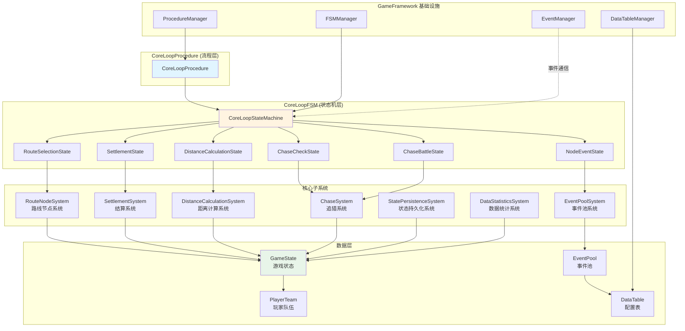
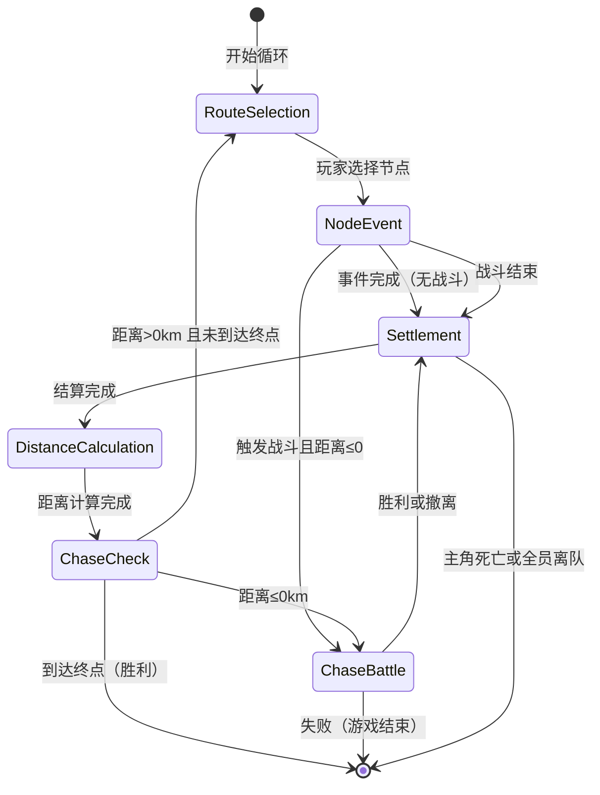

# 技术设计文档：核心循环系统

## Overview

核心循环系统是"前路迷途"游戏的核心玩法驱动器，负责管理玩家在逃亡过程中的完整游戏循环。系统基于 GameFramework 的 Procedure（流程）和 FSM（状态机）架构，通过状态驱动的方式组织路线选择、事件触发、战斗结算、距离计算和追猎战等核心玩法模块。

### 设计目标

1. **流程清晰**：通过 FSM 状态机明确定义循环的各个阶段，确保状态转换逻辑清晰可维护
2. **模块解耦**：各子系统（节点选择、事件触发、结算、距离计算）通过事件和数据接口通信，降低耦合度
3. **性能优化**：单次循环控制在 1-2 分钟，状态保存不超过 100 毫秒，满足微信小游戏性能要求
4. **可扩展性**：事件池、节点类型、结算规则均支持配置化扩展，便于快速迭代内容
5. **可测试性**：核心逻辑与 Unity 依赖解耦，支持单元测试和属性测试

### 技术栈

- **Unity 2021.3+**：游戏引擎
- **GameFramework**：流程管理（Procedure）、状态机（FSM）、数据表（DataTable）、事件系统（Event）
- **C# 9.0**：开发语言
- **JSON**：状态序列化格式
- **微信小游戏 SDK**：平台适配

## Architecture

### 系统架构图



### 架构分层说明

#### 1. 流程层（Procedure Layer）

**CoreLoopProcedure** 是核心循环的顶层流程控制器，继承自 GameFramework 的 `ProcedureBase`。它负责：
- 初始化核心循环状态机
- 管理循环的生命周期（进入、更新、退出）
- 处理与其他 Procedure 的切换（如主菜单、结算界面）
- 订阅和分发全局游戏事件

#### 2. 状态机层（FSM Layer）

**CoreLoopStateMachine** 使用 GameFramework 的 FSM 管理循环的六个核心状态：

1. **RouteSelectionState（路线选择状态）**
   - 生成可选路线节点（2-4个）
   - 展示节点信息（类型、风险、距离）
   - 等待玩家选择
   - 转换条件：玩家确认选择 → NodeEventState

2. **NodeEventState（节点事件状态）**
   - 从事件池抽取匹配事件
   - 展示事件描述和选项
   - 等待玩家决策
   - 转换条件：玩家完成决策 → SettlementState 或 ChaseBattleState（如果触发战斗）

3. **SettlementState（结算状态）**
   - 计算资源变化
   - 计算队伍成员状态变化
   - 计算关系变化
   - 展示结算摘要
   - 转换条件：结算完成 → DistanceCalculationState

4. **DistanceCalculationState（距离计算状态）**
   - 应用大恐怖基础追近（-4km）
   - 应用玩家行为影响（急行军、深度搜刮等）
   - 应用节点类型影响
   - 更新UI追逐进度条
   - 转换条件：计算完成 → ChaseCheckState

5. **ChaseCheckState（追猎检查状态）**
   - 检查距离是否 ≤ 0km
   - 转换条件：
     - 距离 ≤ 0km → ChaseBattleState
     - 距离 > 0km 且未到达终点 → RouteSelectionState
     - 到达终点 → 退出循环，触发胜利结算

6. **ChaseBattleState（追猎战状态）**
   - 展示追猎战警告
   - 进入追猎战战斗流程
   - 处理战斗结果（胜利/失败/撤离）
   - 转换条件：
     - 胜利 → SettlementState（增加距离和奖励）
     - 失败 → 退出循环，触发失败结算
     - 撤离 → SettlementState（施加惩罚）

#### 3. 子系统层（Subsystem Layer）

各子系统负责具体的业务逻辑，与状态机通过接口解耦：

- **RouteNodeSystem**：生成和管理路线节点
- **EventPoolSystem**：管理事件池，提供事件抽取逻辑
- **SettlementSystem**：处理战斗和事件结算
- **DistanceCalculationSystem**：计算和维护大恐怖距离
- **ChaseSystem**：管理追猎战逻辑
- **StatePersistenceSystem**：处理状态序列化和持久化
- **DataStatisticsSystem**：记录和统计循环数据

#### 4. 数据层（Data Layer）

- **GameState**：核心游戏状态容器，包含队伍、资源、距离、循环历史等
- **PlayerTeam**：玩家队伍数据，包含成员列表和共享资源
- **EventPool**：事件数据集合
- **DataTable**：GameFramework 配置表，存储节点配置、事件配置、结算规则等

#### 5. 基础设施层（Infrastructure Layer）

依赖 GameFramework 提供的核心服务：
- **ProcedureManager**：流程管理器
- **FSMManager**：状态机管理器
- **EventManager**：事件系统
- **DataTableManager**：配置表管理器


## Components and Interfaces

### 1. CoreLoopProcedure

核心循环流程控制器，继承自 `ProcedureBase`。

```csharp
/// <summary>
/// 核心循环流程
/// </summary>
public class CoreLoopProcedure : ProcedureBase
{
    private IFsm<IProcedureManager> m_ProcedureFsm;
    private CoreLoopStateMachine m_CoreLoopFSM;
    
    /// <summary>
    /// 进入流程时初始化
    /// </summary>
    protected override void OnEnter(IFsm<IProcedureManager> procedureOwner)
    {
        base.OnEnter(procedureOwner);
        m_ProcedureFsm = procedureOwner;
        
        // 初始化核心循环状态机
        m_CoreLoopFSM = new CoreLoopStateMachine();
        m_CoreLoopFSM.Initialize();
        
        // 订阅循环结束事件
        GameEntry.Event.Subscribe(CoreLoopEndEventArgs.EventId, OnCoreLoopEnd);
    }
    
    /// <summary>
    /// 更新流程
    /// </summary>
    protected override void OnUpdate(IFsm<IProcedureManager> procedureOwner, float elapseSeconds, float realElapseSeconds)
    {
        base.OnUpdate(procedureOwner, elapseSeconds, realElapseSeconds);
        m_CoreLoopFSM.Update(elapseSeconds);
    }
    
    /// <summary>
    /// 离开流程时清理
    /// </summary>
    protected override void OnLeave(IFsm<IProcedureManager> procedureOwner, bool isShutdown)
    {
        GameEntry.Event.Unsubscribe(CoreLoopEndEventArgs.EventId, OnCoreLoopEnd);
        m_CoreLoopFSM.Shutdown();
        base.OnLeave(procedureOwner, isShutdown);
    }
    
    /// <summary>
    /// 处理循环结束事件
    /// </summary>
    private void OnCoreLoopEnd(object sender, GameEventArgs e)
    {
        CoreLoopEndEventArgs args = (CoreLoopEndEventArgs)e;
        if (args.IsVictory)
        {
            ChangeState<VictorySettlementProcedure>(m_ProcedureFsm);
        }
        else
        {
            ChangeState<DefeatSettlementProcedure>(m_ProcedureFsm);
        }
    }
}
```

### 2. CoreLoopStateMachine

核心循环状态机，管理六个核心状态的转换。

```csharp
/// <summary>
/// 核心循环状态机
/// </summary>
public class CoreLoopStateMachine
{
    private IFsm<CoreLoopStateMachine> m_FSM;
    private readonly GameState m_GameState;
    
    public CoreLoopStateMachine()
    {
        m_GameState = GameEntry.Data.GetData<GameState>();
    }
    
    /// <summary>
    /// 初始化状态机
    /// </summary>
    public void Initialize()
    {
        FsmState<CoreLoopStateMachine>[] states = new FsmState<CoreLoopStateMachine>[]
        {
            new RouteSelectionState(),
            new NodeEventState(),
            new SettlementState(),
            new DistanceCalculationState(),
            new ChaseCheckState(),
            new ChaseBattleState()
        };
        
        m_FSM = GameEntry.Fsm.CreateFsm(this, states);
        m_FSM.Start<RouteSelectionState>();
    }
    
    /// <summary>
    /// 更新状态机
    /// </summary>
    public void Update(float deltaTime)
    {
        // FSM 由 GameFramework 自动更新
    }
    
    /// <summary>
    /// 关闭状态机
    /// </summary>
    public void Shutdown()
    {
        GameEntry.Fsm.DestroyFsm(m_FSM);
    }
    
    /// <summary>
    /// 获取游戏状态
    /// </summary>
    public GameState GetGameState() => m_GameState;
}
```

### 3. RouteNodeSystem

路线节点系统，负责生成和管理可选节点。

```csharp
/// <summary>
/// 路线节点系统
/// </summary>
public class RouteNodeSystem
{
    private readonly IDataTable<DRRouteNode> m_NodeTable;
    private readonly GameState m_GameState;
    
    public RouteNodeSystem()
    {
        m_NodeTable = GameEntry.DataTable.GetDataTable<DRRouteNode>();
        m_GameState = GameEntry.Data.GetData<GameState>();
    }
    
    /// <summary>
    /// 生成可选路线节点
    /// </summary>
    /// <param name="count">节点数量（2-4）</param>
    /// <returns>路线节点列表</returns>
    public List<RouteNode> GenerateRouteNodes(int count)
    {
        if (count < 2 || count > 4)
        {
            throw new ArgumentOutOfRangeException(nameof(count), "节点数量必须在2到4之间");
        }
        
        List<RouteNode> nodes = new List<RouteNode>();
        
        // 根据当前进度和距离状态调整节点类型权重
        NodeTypeWeights weights = CalculateNodeTypeWeights();
        
        for (int i = 0; i < count; i++)
        {
            NodeType type = SelectNodeTypeByWeight(weights);
            RouteNode node = CreateNodeByType(type);
            nodes.Add(node);
        }
        
        return nodes;
    }
    
    /// <summary>
    /// 计算节点类型权重
    /// </summary>
    private NodeTypeWeights CalculateNodeTypeWeights()
    {
        float distance = m_GameState.TerrorDistance;
        int loopCount = m_GameState.LoopCount;
        
        // 距离越近，高危节点和捷径节点权重越高
        float dangerWeight = Mathf.Lerp(1f, 3f, 1f - distance / 50f);
        float shortcutWeight = distance < 10f ? 2f : 1f;
        
        return new NodeTypeWeights
        {
            SafeWeight = 1f,
            ResourceWeight = 1.5f,
            ShortcutWeight = shortcutWeight,
            DangerWeight = dangerWeight
        };
    }
    
    /// <summary>
    /// 根据权重选择节点类型
    /// </summary>
    private NodeType SelectNodeTypeByWeight(NodeTypeWeights weights)
    {
        float total = weights.SafeWeight + weights.ResourceWeight + 
                      weights.ShortcutWeight + weights.DangerWeight;
        float random = UnityEngine.Random.Range(0f, total);
        
        if (random < weights.SafeWeight)
            return NodeType.Safe;
        if (random < weights.SafeWeight + weights.ResourceWeight)
            return NodeType.Resource;
        if (random < weights.SafeWeight + weights.ResourceWeight + weights.ShortcutWeight)
            return NodeType.Shortcut;
        return NodeType.Danger;
    }
    
    /// <summary>
    /// 根据类型创建节点
    /// </summary>
    private RouteNode CreateNodeByType(NodeType type)
    {
        // 从配置表中随机选择该类型的节点配置
        DRRouteNode[] configs = m_NodeTable.GetDataRows(dr => dr.NodeType == (int)type);
        DRRouteNode config = configs[UnityEngine.Random.Range(0, configs.Length)];
        
        return new RouteNode
        {
            Id = config.Id,
            Type = type,
            Name = config.Name,
            Description = config.Description,
            RiskLevel = config.RiskLevel,
            DistanceBonus = config.DistanceBonus,
            EventPoolId = config.EventPoolId
        };
    }
}
```

### 4. EventPoolSystem

事件池系统，管理事件抽取和权重计算。

```csharp
/// <summary>
/// 事件池系统
/// </summary>
public class EventPoolSystem
{
    private readonly IDataTable<DREvent> m_EventTable;
    private readonly Dictionary<int, List<EventData>> m_EventPools;
    private readonly Dictionary<int, float> m_EventCooldowns; // 事件ID -> 冷却剩余时间
    
    public EventPoolSystem()
    {
        m_EventTable = GameEntry.DataTable.GetDataTable<DREvent>();
        m_EventPools = new Dictionary<int, List<EventData>>();
        m_EventCooldowns = new Dictionary<int, float>();
        LoadEventPools();
    }
    
    /// <summary>
    /// 从配置表加载事件池
    /// </summary>
    private void LoadEventPools()
    {
        DREvent[] allEvents = m_EventTable.GetAllDataRows();
        foreach (var eventConfig in allEvents)
        {
            int poolId = eventConfig.PoolId;
            if (!m_EventPools.ContainsKey(poolId))
            {
                m_EventPools[poolId] = new List<EventData>();
            }
            
            m_EventPools[poolId].Add(new EventData
            {
                Id = eventConfig.Id,
                Type = (EventType)eventConfig.EventType,
                Name = eventConfig.Name,
                Description = eventConfig.Description,
                Weight = eventConfig.Weight,
                CooldownTurns = eventConfig.CooldownTurns,
                TriggerConditions = ParseConditions(eventConfig.TriggerConditions),
                Options = ParseOptions(eventConfig.Options)
            });
        }
    }
    
    /// <summary>
    /// 从事件池中抽取事件
    /// </summary>
    /// <param name="poolId">事件池ID</param>
    /// <param name="nodeType">节点类型（用于调整权重）</param>
    /// <returns>抽取的事件，如果没有可用事件则返回null</returns>
    public EventData DrawEvent(int poolId, NodeType nodeType)
    {
        if (!m_EventPools.ContainsKey(poolId))
        {
            Log.Error($"事件池 {poolId} 不存在");
            return null;
        }
        
        List<EventData> pool = m_EventPools[poolId];
        GameState gameState = GameEntry.Data.GetData<GameState>();
        
        // 筛选可用事件（满足触发条件且不在冷却中）
        List<EventData> availableEvents = pool.Where(e => 
            CheckTriggerConditions(e, gameState) && 
            !IsInCooldown(e.Id)
        ).ToList();
        
        if (availableEvents.Count == 0)
        {
            Log.Warning($"事件池 {poolId} 没有可用事件");
            return null;
        }
        
        // 根据节点类型调整权重
        List<float> adjustedWeights = availableEvents.Select(e => 
            AdjustWeightByNodeType(e, nodeType)
        ).ToList();
        
        // 加权随机选择
        EventData selectedEvent = WeightedRandomSelect(availableEvents, adjustedWeights);
        
        // 设置冷却
        if (selectedEvent.CooldownTurns > 0)
        {
            m_EventCooldowns[selectedEvent.Id] = selectedEvent.CooldownTurns;
        }
        
        return selectedEvent;
    }
    
    /// <summary>
    /// 检查事件触发条件
    /// </summary>
    private bool CheckTriggerConditions(EventData eventData, GameState gameState)
    {
        foreach (var condition in eventData.TriggerConditions)
        {
            if (!condition.Evaluate(gameState))
            {
                return false;
            }
        }
        return true;
    }
    
    /// <summary>
    /// 检查事件是否在冷却中
    /// </summary>
    private bool IsInCooldown(int eventId)
    {
        return m_EventCooldowns.ContainsKey(eventId) && m_EventCooldowns[eventId] > 0;
    }
    
    /// <summary>
    /// 根据节点类型调整事件权重
    /// </summary>
    private float AdjustWeightByNodeType(EventData eventData, NodeType nodeType)
    {
        float baseWeight = eventData.Weight;
        
        // 资源节点优先搜刮事件
        if (nodeType == NodeType.Resource && eventData.Type == EventType.Scavenge)
        {
            return baseWeight * 2f;
        }
        
        // 高危节点优先遭遇和冲突事件
        if (nodeType == NodeType.Danger && 
            (eventData.Type == EventType.Encounter || eventData.Type == EventType.Conflict))
        {
            return baseWeight * 2f;
        }
        
        // 安全节点降低冲突事件权重
        if (nodeType == NodeType.Safe && eventData.Type == EventType.Conflict)
        {
            return baseWeight * 0.5f;
        }
        
        return baseWeight;
    }
    
    /// <summary>
    /// 加权随机选择
    /// </summary>
    private EventData WeightedRandomSelect(List<EventData> events, List<float> weights)
    {
        float totalWeight = weights.Sum();
        float random = UnityEngine.Random.Range(0f, totalWeight);
        
        float cumulative = 0f;
        for (int i = 0; i < events.Count; i++)
        {
            cumulative += weights[i];
            if (random < cumulative)
            {
                return events[i];
            }
        }
        
        return events[events.Count - 1];
    }
    
    /// <summary>
    /// 更新事件冷却（每回合调用）
    /// </summary>
    public void UpdateCooldowns()
    {
        List<int> expiredEvents = new List<int>();
        foreach (var kvp in m_EventCooldowns)
        {
            m_EventCooldowns[kvp.Key] = kvp.Value - 1;
            if (m_EventCooldowns[kvp.Key] <= 0)
            {
                expiredEvents.Add(kvp.Key);
            }
        }
        
        foreach (int eventId in expiredEvents)
        {
            m_EventCooldowns.Remove(eventId);
        }
    }
    
    // 辅助方法：解析触发条件和选项（省略具体实现）
    private List<EventCondition> ParseConditions(string conditionsJson) { /* ... */ return null; }
    private List<EventOption> ParseOptions(string optionsJson) { /* ... */ return null; }
}
```

### 5. SettlementSystem

结算系统，处理战斗和事件后的资源、状态、关系变化。

```csharp
/// <summary>
/// 结算系统
/// </summary>
public class SettlementSystem
{
    private readonly GameState m_GameState;
    
    public SettlementSystem()
    {
        m_GameState = GameEntry.Data.GetData<GameState>();
    }
    
    /// <summary>
    /// 执行结算
    /// </summary>
    /// <param name="settlementData">结算数据</param>
    /// <returns>结算结果摘要</returns>
    public SettlementResult ExecuteSettlement(SettlementData settlementData)
    {
        SettlementResult result = new SettlementResult();
        
        // 1. 计算资源变化
        result.ResourceChanges = CalculateResourceChanges(settlementData);
        ApplyResourceChanges(result.ResourceChanges);
        
        // 2. 计算队伍成员状态变化
        result.MemberStateChanges = CalculateMemberStateChanges(settlementData);
        ApplyMemberStateChanges(result.MemberStateChanges);
        
        // 3. 计算关系变化
        result.RelationshipChanges = CalculateRelationshipChanges(settlementData);
        ApplyRelationshipChanges(result.RelationshipChanges);
        
        // 4. 检查成员死亡或离队
        result.CasualtyEvents = CheckCasualties();
        
        // 5. 保存结算历史
        m_GameState.SettlementHistory.Add(result);
        
        return result;
    }
    
    /// <summary>
    /// 计算资源变化
    /// </summary>
    private ResourceChanges CalculateResourceChanges(SettlementData data)
    {
        ResourceChanges changes = new ResourceChanges();
        
        // 从结算规则中读取资源变化
        foreach (var rule in data.SettlementRules)
        {
            if (rule.Type == SettlementRuleType.ResourceChange)
            {
                changes.FoodChange += rule.GetValue("food");
                changes.MedicineChange += rule.GetValue("medicine");
                changes.AmmoChange += rule.GetValue("ammo");
                changes.PartsChange += rule.GetValue("parts");
            }
        }
        
        return changes;
    }
    
    /// <summary>
    /// 应用资源变化
    /// </summary>
    private void ApplyResourceChanges(ResourceChanges changes)
    {
        PlayerTeam team = m_GameState.PlayerTeam;
        team.Resources.Food = Mathf.Max(0, team.Resources.Food + changes.FoodChange);
        team.Resources.Medicine = Mathf.Max(0, team.Resources.Medicine + changes.MedicineChange);
        team.Resources.Ammo = Mathf.Max(0, team.Resources.Ammo + changes.AmmoChange);
        team.Resources.Parts = Mathf.Max(0, team.Resources.Parts + changes.PartsChange);
    }
    
    /// <summary>
    /// 计算队伍成员状态变化
    /// </summary>
    private List<MemberStateChange> CalculateMemberStateChanges(SettlementData data)
    {
        List<MemberStateChange> changes = new List<MemberStateChange>();
        
        foreach (var rule in data.SettlementRules)
        {
            if (rule.Type == SettlementRuleType.MemberStateChange)
            {
                int memberId = rule.GetValue("memberId");
                TeamMember member = m_GameState.PlayerTeam.GetMember(memberId);
                
                if (member != null)
                {
                    MemberStateChange change = new MemberStateChange
                    {
                        MemberId = memberId,
                        MemberName = member.Name,
                        HealthChange = rule.GetValue("health"),
                        StressChange = rule.GetValue("stress"),
                        LoyaltyChange = rule.GetValue("loyalty"),
                        InjuryLevelChange = rule.GetValue("injuryLevel")
                    };
                    changes.Add(change);
                }
            }
        }
        
        return changes;
    }
    
    /// <summary>
    /// 应用成员状态变化
    /// </summary>
    private void ApplyMemberStateChanges(List<MemberStateChange> changes)
    {
        foreach (var change in changes)
        {
            TeamMember member = m_GameState.PlayerTeam.GetMember(change.MemberId);
            if (member != null)
            {
                member.Health = Mathf.Clamp(member.Health + change.HealthChange, 0, member.MaxHealth);
                member.Stress = Mathf.Clamp(member.Stress + change.StressChange, 0, 100);
                member.Loyalty = Mathf.Clamp(member.Loyalty + change.LoyaltyChange, 0, 100);
                member.InjuryLevel = Mathf.Clamp(member.InjuryLevel + change.InjuryLevelChange, 0, 3);
            }
        }
    }
    
    /// <summary>
    /// 计算关系变化
    /// </summary>
    private List<RelationshipChange> CalculateRelationshipChanges(SettlementData data)
    {
        List<RelationshipChange> changes = new List<RelationshipChange>();
        
        foreach (var rule in data.SettlementRules)
        {
            if (rule.Type == SettlementRuleType.RelationshipChange)
            {
                changes.Add(new RelationshipChange
                {
                    MemberAId = rule.GetValue("memberAId"),
                    MemberBId = rule.GetValue("memberBId"),
                    RelationshipChange = rule.GetValue("change")
                });
            }
        }
        
        return changes;
    }
    
    /// <summary>
    /// 应用关系变化
    /// </summary>
    private void ApplyRelationshipChanges(List<RelationshipChange> changes)
    {
        foreach (var change in changes)
        {
            m_GameState.PlayerTeam.AdjustRelationship(
                change.MemberAId, 
                change.MemberBId, 
                change.RelationshipChange
            );
        }
    }
    
    /// <summary>
    /// 检查伤亡事件
    /// </summary>
    private List<CasualtyEvent> CheckCasualties()
    {
        List<CasualtyEvent> casualties = new List<CasualtyEvent>();
        
        foreach (var member in m_GameState.PlayerTeam.Members)
        {
            // 检查死亡
            if (member.Health <= 0)
            {
                casualties.Add(new CasualtyEvent
                {
                    MemberId = member.Id,
                    MemberName = member.Name,
                    Type = CasualtyType.Death,
                    Reason = "生命值归零"
                });
                member.IsDead = true;
            }
            // 检查离队（忠诚度过低）
            else if (member.Loyalty <= 0)
            {
                casualties.Add(new CasualtyEvent
                {
                    MemberId = member.Id,
                    MemberName = member.Name,
                    Type = CasualtyType.Desertion,
                    Reason = "忠诚度过低"
                });
                member.HasLeft = true;
            }
        }
        
        return casualties;
    }
}
```

### 6. DistanceCalculationSystem

距离计算系统，管理大恐怖距离的变化。

```csharp
/// <summary>
/// 距离计算系统
/// </summary>
public class DistanceCalculationSystem
{
    private readonly GameState m_GameState;
    private const float BASE_CHASE_SPEED = 4f; // 大恐怖基础追近速度（km/回合）
    private const float RUSH_DISTANCE_BONUS = 6f; // 急行军距离增加
    private const float RUSH_STRESS_COST = 8f; // 急行军压力代价
    private const float DEEP_SCAVENGE_DISTANCE_PENALTY = 5f; // 深度搜刮距离减少
    private const float BATTLE_TIMEOUT_PENALTY_PER_10S = 1f; // 战斗超时惩罚
    
    public DistanceCalculationSystem()
    {
        m_GameState = GameEntry.Data.GetData<GameState>();
    }
    
    /// <summary>
    /// 执行距离计算
    /// </summary>
    /// <param name="calculationData">计算数据</param>
    /// <returns>距离变化结果</returns>
    public DistanceCalculationResult Calculate(DistanceCalculationData calculationData)
    {
        DistanceCalculationResult result = new DistanceCalculationResult();
        result.InitialDistance = m_GameState.TerrorDistance;
        
        // 1. 应用大恐怖基础追近
        float baseChase = -BASE_CHASE_SPEED;
        result.AddChange("大恐怖追近", baseChase);
        
        // 2. 应用玩家行为影响
        if (calculationData.PlayerActions.Contains(PlayerAction.Rush))
        {
            result.AddChange("急行军", RUSH_DISTANCE_BONUS);
            ApplyRushStressCost();
        }
        
        if (calculationData.PlayerActions.Contains(PlayerAction.DeepScavenge))
        {
            result.AddChange("深度搜刮", -DEEP_SCAVENGE_DISTANCE_PENALTY);
        }
        
        // 3. 应用战斗超时惩罚
        if (calculationData.BattleTimeoutSeconds > 0)
        {
            float timeoutPenalty = -(calculationData.BattleTimeoutSeconds / 10f) * BATTLE_TIMEOUT_PENALTY_PER_10S;
            result.AddChange($"战斗超时 ({calculationData.BattleTimeoutSeconds}秒)", timeoutPenalty);
        }
        
        // 4. 应用节点类型影响
        if (calculationData.NodeType == NodeType.Shortcut)
        {
            float shortcutBonus = UnityEngine.Random.Range(3f, 5f);
            result.AddChange("捷径节点", shortcutBonus);
        }
        
        // 5. 计算最终距离
        result.FinalDistance = result.InitialDistance + result.TotalChange;
        result.FinalDistance = Mathf.Max(result.FinalDistance, -10f); // 最低-10km（允许负值以触发追猎战）
        
        // 6. 更新游戏状态
        m_GameState.TerrorDistance = result.FinalDistance;
        m_GameState.DistanceHistory.Add(new DistanceHistoryEntry
        {
            LoopCount = m_GameState.LoopCount,
            Distance = result.FinalDistance,
            Changes = result.Changes
        });
        
        // 7. 触发UI更新事件
        if (Mathf.Abs(result.TotalChange) >= 5f)
        {
            GameEntry.Event.Fire(this, DistanceSignificantChangeEventArgs.Create(result));
        }
        
        return result;
    }
    
    /// <summary>
    /// 应用急行军压力代价
    /// </summary>
    private void ApplyRushStressCost()
    {
        foreach (var member in m_GameState.PlayerTeam.Members)
        {
            member.Stress = Mathf.Min(100, member.Stress + RUSH_STRESS_COST);
        }
    }
    
    /// <summary>
    /// 获取当前距离状态
    /// </summary>
    public DistanceStatus GetDistanceStatus()
    {
        float distance = m_GameState.TerrorDistance;
        
        if (distance <= 0)
            return DistanceStatus.Critical; // 触发追猎战
        if (distance <= 10)
            return DistanceStatus.Dangerous; // 危险
        if (distance <= 20)
            return DistanceStatus.Warning; // 警告
        return DistanceStatus.Safe; // 安全
    }
}
```

### 7. ChaseSystem

追猎系统，管理追猎战的触发和处理。

```csharp
/// <summary>
/// 追猎系统
/// </summary>
public class ChaseSystem
{
    private readonly GameState m_GameState;
    private const float CHASE_VICTORY_DISTANCE_BONUS = 15f; // 追猎战胜利距离奖励
    private const float CHASE_RETREAT_DISTANCE_PENALTY = 8f; // 追猎战撤离距离惩罚
    
    public ChaseSystem()
    {
        m_GameState = GameEntry.Data.GetData<GameState>();
    }
    
    /// <summary>
    /// 检查是否触发追猎战
    /// </summary>
    public bool ShouldTriggerChaseBattle()
    {
        return m_GameState.TerrorDistance <= 0;
    }
    
    /// <summary>
    /// 开始追猎战
    /// </summary>
    public ChaseBattleContext StartChaseBattle()
    {
        m_GameState.ChaseBattleCount++;
        
        return new ChaseBattleContext
        {
            BattleId = m_GameState.ChaseBattleCount,
            PlayerTeam = m_GameState.PlayerTeam,
            TerrorDistance = m_GameState.TerrorDistance,
            Difficulty = CalculateChaseBattleDifficulty()
        };
    }
    
    /// <summary>
    /// 计算追猎战难度
    /// </summary>
    private ChaseBattleDifficulty CalculateChaseBattleDifficulty()
    {
        // 根据循环次数和队伍状态调整难度
        int loopCount = m_GameState.LoopCount;
        float avgHealth = m_GameState.PlayerTeam.GetAverageHealth();
        
        if (loopCount >= 10 || avgHealth < 30)
            return ChaseBattleDifficulty.Hard;
        if (loopCount >= 5 || avgHealth < 50)
            return ChaseBattleDifficulty.Normal;
        return ChaseBattleDifficulty.Easy;
    }
    
    /// <summary>
    /// 处理追猎战胜利
    /// </summary>
    public ChaseBattleResult HandleVictory()
    {
        // 增加距离
        m_GameState.TerrorDistance += CHASE_VICTORY_DISTANCE_BONUS;
        
        // 给予爆发性补给奖励
        PlayerTeam team = m_GameState.PlayerTeam;
        team.Resources.Food += 20;
        team.Resources.Medicine += 10;
        team.Resources.Ammo += 30;
        team.Resources.Parts += 15;
        
        return new ChaseBattleResult
        {
            Outcome = ChaseBattleOutcome.Victory,
            DistanceChange = CHASE_VICTORY_DISTANCE_BONUS,
            Rewards = new ResourceChanges
            {
                FoodChange = 20,
                MedicineChange = 10,
                AmmoChange = 30,
                PartsChange = 15
            }
        };
    }
    
    /// <summary>
    /// 处理追猎战失败
    /// </summary>
    public ChaseBattleResult HandleDefeat()
    {
        // 触发强制惨痛代价
        List<CasualtyEvent> casualties = ApplyDefeatPenalty();
        
        return new ChaseBattleResult
        {
            Outcome = ChaseBattleOutcome.Defeat,
            Casualties = casualties,
            IsGameOver = CheckGameOver()
        };
    }
    
    /// <summary>
    /// 处理追猎战撤离
    /// </summary>
    public ChaseBattleResult HandleRetreat()
    {
        // 进一步缩短距离
        m_GameState.TerrorDistance -= CHASE_RETREAT_DISTANCE_PENALTY;
        
        // 施加队伍状态恶化
        foreach (var member in m_GameState.PlayerTeam.Members)
        {
            member.Stress = Mathf.Min(100, member.Stress + 15);
            member.Loyalty = Mathf.Max(0, member.Loyalty - 10);
        }
        
        return new ChaseBattleResult
        {
            Outcome = ChaseBattleOutcome.Retreat,
            DistanceChange = -CHASE_RETREAT_DISTANCE_PENALTY,
            StressPenalty = 15,
            LoyaltyPenalty = 10
        };
    }
    
    /// <summary>
    /// 应用失败惩罚
    /// </summary>
    private List<CasualtyEvent> ApplyDefeatPenalty()
    {
        List<CasualtyEvent> casualties = new List<CasualtyEvent>();
        
        // 随机选择1-2名成员死亡或重伤
        List<TeamMember> aliveMembers = m_GameState.PlayerTeam.Members
            .Where(m => !m.IsDead && !m.HasLeft)
            .ToList();
        
        int casualtyCount = UnityEngine.Random.Range(1, Mathf.Min(3, aliveMembers.Count + 1));
        
        for (int i = 0; i < casualtyCount; i++)
        {
            TeamMember victim = aliveMembers[UnityEngine.Random.Range(0, aliveMembers.Count)];
            aliveMembers.Remove(victim);
            
            victim.Health = 0;
            victim.IsDead = true;
            
            casualties.Add(new CasualtyEvent
            {
                MemberId = victim.Id,
                MemberName = victim.Name,
                Type = CasualtyType.Death,
                Reason = "追猎战失败"
            });
        }
        
        // 损失大量资源
        PlayerTeam team = m_GameState.PlayerTeam;
        team.Resources.Food = Mathf.Max(0, team.Resources.Food - 30);
        team.Resources.Medicine = Mathf.Max(0, team.Resources.Medicine - 20);
        team.Resources.Ammo = Mathf.Max(0, team.Resources.Ammo - 40);
        
        return casualties;
    }
    
    /// <summary>
    /// 检查游戏是否结束
    /// </summary>
    private bool CheckGameOver()
    {
        // 主角死亡或全员离队
        TeamMember protagonist = m_GameState.PlayerTeam.GetProtagonist();
        if (protagonist.IsDead)
            return true;
        
        int aliveCount = m_GameState.PlayerTeam.Members.Count(m => !m.IsDead && !m.HasLeft);
        return aliveCount == 0;
    }
}
```

### 8. StatePersistenceSystem

状态持久化系统，处理游戏状态的序列化和保存。

```csharp
/// <summary>
/// 状态持久化系统
/// </summary>
public class StatePersistenceSystem
{
    private const string SAVE_KEY = "CoreLoopState";
    private readonly GameState m_GameState;
    
    public StatePersistenceSystem()
    {
        m_GameState = GameEntry.Data.GetData<GameState>();
    }
    
    /// <summary>
    /// 保存游戏状态
    /// </summary>
    /// <returns>保存是否成功</returns>
    public bool SaveState()
    {
        System.Diagnostics.Stopwatch stopwatch = System.Diagnostics.Stopwatch.StartNew();
        
        try
        {
            // 序列化游戏状态
            string json = SerializeGameState(m_GameState);
            
            // 保存到本地存储（微信小游戏使用 PlayerPrefs 或文件系统）
            #if UNITY_WECHAT_GAME
            WX.SetStorageSync(SAVE_KEY, json);
            #else
            PlayerPrefs.SetString(SAVE_KEY, json);
            PlayerPrefs.Save();
            #endif
            
            stopwatch.Stop();
            
            // 确保保存时间不超过100ms
            if (stopwatch.ElapsedMilliseconds > 100)
            {
                Log.Warning($"状态保存耗时 {stopwatch.ElapsedMilliseconds}ms，超过100ms阈值");
            }
            
            Log.Info($"游戏状态保存成功，耗时 {stopwatch.ElapsedMilliseconds}ms");
            return true;
        }
        catch (Exception e)
        {
            Log.Error($"游戏状态保存失败: {e.Message}");
            return false;
        }
    }
    
    /// <summary>
    /// 加载游戏状态
    /// </summary>
    /// <returns>加载的游戏状态，失败返回null</returns>
    public GameState LoadState()
    {
        try
        {
            string json;
            
            #if UNITY_WECHAT_GAME
            json = WX.GetStorageSync(SAVE_KEY, "");
            #else
            json = PlayerPrefs.GetString(SAVE_KEY, "");
            #endif
            
            if (string.IsNullOrEmpty(json))
            {
                Log.Info("没有找到保存的游戏状态");
                return null;
            }
            
            // 反序列化游戏状态
            GameState loadedState = DeserializeGameState(json);
            
            // 验证状态完整性
            if (!ValidateGameState(loadedState))
            {
                Log.Error("加载的游戏状态验证失败");
                return null;
            }
            
            Log.Info("游戏状态加载成功");
            return loadedState;
        }
        catch (Exception e)
        {
            Log.Error($"游戏状态加载失败: {e.Message}");
            return null;
        }
    }
    
    /// <summary>
    /// 序列化游戏状态
    /// </summary>
    private string SerializeGameState(GameState state)
    {
        // 使用 JSON 序列化
        GameStateSaveData saveData = new GameStateSaveData
        {
            CurrentLoopState = state.CurrentLoopState.ToString(),
            LoopCount = state.LoopCount,
            TerrorDistance = state.TerrorDistance,
            PlayerTeam = SerializePlayerTeam(state.PlayerTeam),
            DistanceHistory = state.DistanceHistory,
            SettlementHistory = state.SettlementHistory.Select(s => s.ToSaveData()).ToList(),
            ChaseBattleCount = state.ChaseBattleCount,
            SaveTime = DateTime.Now.ToString("yyyy-MM-dd HH:mm:ss")
        };
        
        return JsonUtility.ToJson(saveData);
    }
    
    /// <summary>
    /// 反序列化游戏状态
    /// </summary>
    private GameState DeserializeGameState(string json)
    {
        GameStateSaveData saveData = JsonUtility.FromJson<GameStateSaveData>(json);
        
        GameState state = new GameState
        {
            CurrentLoopState = (CoreLoopState)Enum.Parse(typeof(CoreLoopState), saveData.CurrentLoopState),
            LoopCount = saveData.LoopCount,
            TerrorDistance = saveData.TerrorDistance,
            PlayerTeam = DeserializePlayerTeam(saveData.PlayerTeam),
            DistanceHistory = saveData.DistanceHistory,
            SettlementHistory = saveData.SettlementHistory.Select(s => SettlementResult.FromSaveData(s)).ToList(),
            ChaseBattleCount = saveData.ChaseBattleCount
        };
        
        return state;
    }
    
    /// <summary>
    /// 验证游戏状态完整性
    /// </summary>
    private bool ValidateGameState(GameState state)
    {
        if (state == null)
            return false;
        
        if (state.PlayerTeam == null || state.PlayerTeam.Members == null)
            return false;
        
        if (state.LoopCount < 0 || state.ChaseBattleCount < 0)
            return false;
        
        return true;
    }
    
    /// <summary>
    /// 删除保存的状态
    /// </summary>
    public void DeleteSavedState()
    {
        #if UNITY_WECHAT_GAME
        WX.RemoveStorageSync(SAVE_KEY);
        #else
        PlayerPrefs.DeleteKey(SAVE_KEY);
        PlayerPrefs.Save();
        #endif
        
        Log.Info("已删除保存的游戏状态");
    }
    
    // 辅助方法：序列化和反序列化 PlayerTeam（省略具体实现）
    private PlayerTeamSaveData SerializePlayerTeam(PlayerTeam team) { /* ... */ return null; }
    private PlayerTeam DeserializePlayerTeam(PlayerTeamSaveData data) { /* ... */ return null; }
}
```

### 9. DataStatisticsSystem

数据统计系统，记录和分析循环数据。

```csharp
/// <summary>
/// 数据统计系统
/// </summary>
public class DataStatisticsSystem
{
    private readonly GameState m_GameState;
    private readonly List<LoopStatistics> m_LoopStatistics;
    
    public DataStatisticsSystem()
    {
        m_GameState = GameEntry.Data.GetData<GameState>();
        m_LoopStatistics = new List<LoopStatistics>();
    }
    
    /// <summary>
    /// 记录循环统计数据
    /// </summary>
    public void RecordLoopStatistics(LoopStatisticsData data)
    {
        LoopStatistics stats = new LoopStatistics
        {
            LoopNumber = m_GameState.LoopCount,
            NodeType = data.SelectedNodeType,
            EventType = data.TriggeredEventType,
            BattleResult = data.BattleResult,
            DistanceChange = data.DistanceChange,
            ResourceChanges = data.ResourceChanges,
            Timestamp = DateTime.Now
        };
        
        m_LoopStatistics.Add(stats);
    }
    
    /// <summary>
    /// 生成统计报告
    /// </summary>
    public StatisticsReport GenerateReport()
    {
        StatisticsReport report = new StatisticsReport
        {
            TotalLoops = m_GameState.LoopCount,
            TotalChaseBattles = m_GameState.ChaseBattleCount,
            FinalDistance = m_GameState.TerrorDistance,
            DistanceCurve = GenerateDistanceCurve(),
            KeyDecisions = IdentifyKeyDecisions(),
            PostMortemAnalysis = GeneratePostMortem()
        };
        
        return report;
    }
    
    /// <summary>
    /// 生成距离变化曲线
    /// </summary>
    private List<DistancePoint> GenerateDistanceCurve()
    {
        return m_GameState.DistanceHistory.Select(entry => new DistancePoint
        {
            LoopNumber = entry.LoopCount,
            Distance = entry.Distance
        }).ToList();
    }
    
    /// <summary>
    /// 识别关键决策点
    /// </summary>
    private List<KeyDecision> IdentifyKeyDecisions()
    {
        List<KeyDecision> decisions = new List<KeyDecision>();
        
        // 识别距离重大变化点
        for (int i = 1; i < m_GameState.DistanceHistory.Count; i++)
        {
            var prev = m_GameState.DistanceHistory[i - 1];
            var curr = m_GameState.DistanceHistory[i];
            float change = curr.Distance - prev.Distance;
            
            if (Mathf.Abs(change) >= 5f)
            {
                decisions.Add(new KeyDecision
                {
                    LoopNumber = curr.LoopCount,
                    Type = change > 0 ? "距离大幅增加" : "距离大幅减少",
                    Description = $"距离变化 {change:F1}km",
                    Reasons = curr.Changes.Select(c => c.Reason).ToList()
                });
            }
        }
        
        // 识别追猎战
        if (m_GameState.ChaseBattleCount > 0)
        {
            decisions.Add(new KeyDecision
            {
                Type = "追猎战",
                Description = $"共触发 {m_GameState.ChaseBattleCount} 次追猎战"
            });
        }
        
        return decisions;
    }
    
    /// <summary>
    /// 生成复盘分析
    /// </summary>
    private PostMortemAnalysis GeneratePostMortem()
    {
        PostMortemAnalysis analysis = new PostMortemAnalysis();
        
        // 分析受损原因
        analysis.DamageReasons = AnalyzeDamageReasons();
        
        // 分析距离变化原因
        analysis.DistanceChangeReasons = AnalyzeDistanceChangeReasons();
        
        // 分析关键失误
        analysis.CriticalMistakes = IdentifyCriticalMistakes();
        
        return analysis;
    }
    
    /// <summary>
    /// 分析受损原因
    /// </summary>
    private List<string> AnalyzeDamageReasons()
    {
        List<string> reasons = new List<string>();
        
        foreach (var settlement in m_GameState.SettlementHistory)
        {
            foreach (var casualty in settlement.CasualtyEvents)
            {
                reasons.Add($"{casualty.MemberName} {casualty.Type}: {casualty.Reason}");
            }
        }
        
        return reasons.Take(3).ToList(); // 返回前3条
    }
    
    /// <summary>
    /// 分析距离变化原因
    /// </summary>
    private List<string> AnalyzeDistanceChangeReasons()
    {
        Dictionary<string, float> reasonTotals = new Dictionary<string, float>();
        
        foreach (var entry in m_GameState.DistanceHistory)
        {
            foreach (var change in entry.Changes)
            {
                if (!reasonTotals.ContainsKey(change.Reason))
                {
                    reasonTotals[change.Reason] = 0;
                }
                reasonTotals[change.Reason] += change.Value;
            }
        }
        
        return reasonTotals
            .OrderBy(kvp => kvp.Value)
            .Take(3)
            .Select(kvp => $"{kvp.Key}: {kvp.Value:F1}km")
            .ToList();
    }
    
    /// <summary>
    /// 识别关键失误
    /// </summary>
    private List<string> IdentifyCriticalMistakes()
    {
        List<string> mistakes = new List<string>();
        
        // 检查是否频繁触发追猎战
        if (m_GameState.ChaseBattleCount >= 3)
        {
            mistakes.Add($"触发了 {m_GameState.ChaseBattleCount} 次追猎战，距离管理不当");
        }
        
        // 检查是否有过多的深度搜刮
        int deepScavengeCount = m_GameState.DistanceHistory
            .SelectMany(e => e.Changes)
            .Count(c => c.Reason == "深度搜刮");
        
        if (deepScavengeCount >= 5)
        {
            mistakes.Add($"进行了 {deepScavengeCount} 次深度搜刮，过度贪婪");
        }
        
        // 检查是否有战斗超时
        int timeoutCount = m_GameState.DistanceHistory
            .SelectMany(e => e.Changes)
            .Count(c => c.Reason.Contains("战斗超时"));
        
        if (timeoutCount >= 2)
        {
            mistakes.Add($"发生了 {timeoutCount} 次战斗超时，战斗效率低下");
        }
        
        return mistakes.Take(3).ToList();
    }
}
```

## Data Models

### 核心数据结构

```csharp
/// <summary>
/// 游戏状态
/// </summary>
public class GameState
{
    /// <summary>当前循环状态</summary>
    public CoreLoopState CurrentLoopState { get; set; }
    
    /// <summary>循环次数</summary>
    public int LoopCount { get; set; }
    
    /// <summary>大恐怖距离（km）</summary>
    public float TerrorDistance { get; set; }
    
    /// <summary>玩家队伍</summary>
    public PlayerTeam PlayerTeam { get; set; }
    
    /// <summary>距离历史记录</summary>
    public List<DistanceHistoryEntry> DistanceHistory { get; set; }
    
    /// <summary>结算历史记录</summary>
    public List<SettlementResult> SettlementHistory { get; set; }
    
    /// <summary>追猎战次数</summary>
    public int ChaseBattleCount { get; set; }
    
    /// <summary>是否到达终点</summary>
    public bool HasReachedDestination { get; set; }
    
    public GameState()
    {
        CurrentLoopState = CoreLoopState.RouteSelection;
        LoopCount = 0;
        TerrorDistance = 50f; // 初始距离50km
        PlayerTeam = new PlayerTeam();
        DistanceHistory = new List<DistanceHistoryEntry>();
        SettlementHistory = new List<SettlementResult>();
        ChaseBattleCount = 0;
        HasReachedDestination = false;
    }
}

/// <summary>
/// 核心循环状态枚举
/// </summary>
public enum CoreLoopState
{
    RouteSelection,      // 路线选择
    NodeEvent,           // 节点事件
    Settlement,          // 结算
    DistanceCalculation, // 距离计算
    ChaseCheck,          // 追猎检查
    ChaseBattle          // 追猎战
}

/// <summary>
/// 玩家队伍
/// </summary>
public class PlayerTeam
{
    /// <summary>队伍成员列表</summary>
    public List<TeamMember> Members { get; set; }
    
    /// <summary>共享资源</summary>
    public TeamResources Resources { get; set; }
    
    /// <summary>成员关系矩阵</summary>
    public Dictionary<(int, int), int> Relationships { get; set; }
    
    public PlayerTeam()
    {
        Members = new List<TeamMember>();
        Resources = new TeamResources();
        Relationships = new Dictionary<(int, int), int>();
    }
    
    /// <summary>获取成员</summary>
    public TeamMember GetMember(int memberId)
    {
        return Members.FirstOrDefault(m => m.Id == memberId);
    }
    
    /// <summary>获取主角</summary>
    public TeamMember GetProtagonist()
    {
        return Members.FirstOrDefault(m => m.IsProtagonist);
    }
    
    /// <summary>获取平均生命值</summary>
    public float GetAverageHealth()
    {
        var aliveMembers = Members.Where(m => !m.IsDead && !m.HasLeft).ToList();
        if (aliveMembers.Count == 0) return 0;
        return aliveMembers.Average(m => m.Health);
    }
    
    /// <summary>调整成员关系</summary>
    public void AdjustRelationship(int memberAId, int memberBId, int change)
    {
        var key = (Mathf.Min(memberAId, memberBId), Mathf.Max(memberAId, memberBId));
        if (!Relationships.ContainsKey(key))
        {
            Relationships[key] = 50; // 初始关系值50
        }
        Relationships[key] = Mathf.Clamp(Relationships[key] + change, 0, 100);
    }
}

/// <summary>
/// 队伍成员
/// </summary>
public class TeamMember
{
    /// <summary>成员ID</summary>
    public int Id { get; set; }
    
    /// <summary>成员名称</summary>
    public string Name { get; set; }
    
    /// <summary>是否为主角</summary>
    public bool IsProtagonist { get; set; }
    
    /// <summary>当前生命值</summary>
    public int Health { get; set; }
    
    /// <summary>最大生命值</summary>
    public int MaxHealth { get; set; }
    
    /// <summary>压力值（0-100）</summary>
    public int Stress { get; set; }
    
    /// <summary>忠诚度（0-100）</summary>
    public int Loyalty { get; set; }
    
    /// <summary>负伤等级（0-3）</summary>
    public int InjuryLevel { get; set; }
    
    /// <summary>是否死亡</summary>
    public bool IsDead { get; set; }
    
    /// <summary>是否离队</summary>
    public bool HasLeft { get; set; }
}

/// <summary>
/// 队伍资源
/// </summary>
public class TeamResources
{
    /// <summary>食物</summary>
    public int Food { get; set; }
    
    /// <summary>药品</summary>
    public int Medicine { get; set; }
    
    /// <summary>弹药</summary>
    public int Ammo { get; set; }
    
    /// <summary>零件</summary>
    public int Parts { get; set; }
    
    public TeamResources()
    {
        Food = 50;
        Medicine = 20;
        Ammo = 100;
        Parts = 30;
    }
}
```

### 路线节点相关数据结构

```csharp
/// <summary>
/// 路线节点
/// </summary>
public class RouteNode
{
    /// <summary>节点ID</summary>
    public int Id { get; set; }
    
    /// <summary>节点类型</summary>
    public NodeType Type { get; set; }
    
    /// <summary>节点名称</summary>
    public string Name { get; set; }
    
    /// <summary>节点描述</summary>
    public string Description { get; set; }
    
    /// <summary>风险等级（1-5）</summary>
    public int RiskLevel { get; set; }
    
    /// <summary>距离推进加成</summary>
    public float DistanceBonus { get; set; }
    
    /// <summary>关联事件池ID</summary>
    public int EventPoolId { get; set; }
}

/// <summary>
/// 节点类型
/// </summary>
public enum NodeType
{
    Safe = 0,      // 安全节点：低风险低收益
    Resource = 1,  // 资源节点：中风险中收益，优先搜刮事件
    Shortcut = 2,  // 捷径节点：中风险，额外距离加成
    Danger = 3     // 高危节点：高风险高收益
}

/// <summary>
/// 节点类型权重
/// </summary>
public struct NodeTypeWeights
{
    public float SafeWeight;
    public float ResourceWeight;
    public float ShortcutWeight;
    public float DangerWeight;
}
```

### 事件相关数据结构

```csharp
/// <summary>
/// 事件数据
/// </summary>
public class EventData
{
    /// <summary>事件ID</summary>
    public int Id { get; set; }
    
    /// <summary>事件类型</summary>
    public EventType Type { get; set; }
    
    /// <summary>事件名称</summary>
    public string Name { get; set; }
    
    /// <summary>事件描述</summary>
    public string Description { get; set; }
    
    /// <summary>事件权重</summary>
    public float Weight { get; set; }
    
    /// <summary>冷却回合数</summary>
    public int CooldownTurns { get; set; }
    
    /// <summary>触发条件列表</summary>
    public List<EventCondition> TriggerConditions { get; set; }
    
    /// <summary>可选行动列表</summary>
    public List<EventOption> Options { get; set; }
}

/// <summary>
/// 事件类型
/// </summary>
public enum EventType
{
    Scavenge = 0,        // 搜刮事件
    Encounter = 1,       // 遭遇事件
    Conflict = 2,        // 冲突事件
    SurvivorInteraction = 3  // 幸存者互动事件
}

/// <summary>
/// 事件条件
/// </summary>
public class EventCondition
{
    /// <summary>条件类型</summary>
    public string ConditionType { get; set; }
    
    /// <summary>条件参数</summary>
    public Dictionary<string, object> Parameters { get; set; }
    
    /// <summary>评估条件是否满足</summary>
    public bool Evaluate(GameState gameState)
    {
        // 根据 ConditionType 执行不同的条件检查逻辑
        // 例如：检查资源数量、队伍状态、距离值等
        return true; // 简化示例
    }
}

/// <summary>
/// 事件选项
/// </summary>
public class EventOption
{
    /// <summary>选项ID</summary>
    public int Id { get; set; }
    
    /// <summary>选项文本</summary>
    public string Text { get; set; }
    
    /// <summary>选项结果描述</summary>
    public string ResultDescription { get; set; }
    
    /// <summary>结算规则列表</summary>
    public List<SettlementRule> SettlementRules { get; set; }
    
    /// <summary>是否触发战斗</summary>
    public bool TriggersBattle { get; set; }
    
    /// <summary>战斗配置ID（如果触发战斗）</summary>
    public int BattleConfigId { get; set; }
}
```

### 结算相关数据结构

```csharp
/// <summary>
/// 结算数据
/// </summary>
public class SettlementData
{
    /// <summary>结算规则列表</summary>
    public List<SettlementRule> SettlementRules { get; set; }
    
    /// <summary>战斗结果（如果有战斗）</summary>
    public BattleResult BattleResult { get; set; }
}

/// <summary>
/// 结算规则
/// </summary>
public class SettlementRule
{
    /// <summary>规则类型</summary>
    public SettlementRuleType Type { get; set; }
    
    /// <summary>规则参数</summary>
    public Dictionary<string, int> Parameters { get; set; }
    
    /// <summary>获取参数值</summary>
    public int GetValue(string key)
    {
        return Parameters.ContainsKey(key) ? Parameters[key] : 0;
    }
}

/// <summary>
/// 结算规则类型
/// </summary>
public enum SettlementRuleType
{
    ResourceChange = 0,      // 资源变化
    MemberStateChange = 1,   // 成员状态变化
    RelationshipChange = 2   // 关系变化
}

/// <summary>
/// 结算结果
/// </summary>
public class SettlementResult
{
    /// <summary>资源变化</summary>
    public ResourceChanges ResourceChanges { get; set; }
    
    /// <summary>成员状态变化列表</summary>
    public List<MemberStateChange> MemberStateChanges { get; set; }
    
    /// <summary>关系变化列表</summary>
    public List<RelationshipChange> RelationshipChanges { get; set; }
    
    /// <summary>伤亡事件列表</summary>
    public List<CasualtyEvent> CasualtyEvents { get; set; }
    
    /// <summary>转换为保存数据</summary>
    public SettlementResultSaveData ToSaveData() { /* ... */ return null; }
    
    /// <summary>从保存数据恢复</summary>
    public static SettlementResult FromSaveData(SettlementResultSaveData data) { /* ... */ return null; }
}

/// <summary>
/// 资源变化
/// </summary>
public class ResourceChanges
{
    public int FoodChange { get; set; }
    public int MedicineChange { get; set; }
    public int AmmoChange { get; set; }
    public int PartsChange { get; set; }
}

/// <summary>
/// 成员状态变化
/// </summary>
public class MemberStateChange
{
    public int MemberId { get; set; }
    public string MemberName { get; set; }
    public int HealthChange { get; set; }
    public int StressChange { get; set; }
    public int LoyaltyChange { get; set; }
    public int InjuryLevelChange { get; set; }
}

/// <summary>
/// 关系变化
/// </summary>
public class RelationshipChange
{
    public int MemberAId { get; set; }
    public int MemberBId { get; set; }
    public int RelationshipChange { get; set; }
}

/// <summary>
/// 伤亡事件
/// </summary>
public class CasualtyEvent
{
    public int MemberId { get; set; }
    public string MemberName { get; set; }
    public CasualtyType Type { get; set; }
    public string Reason { get; set; }
}

/// <summary>
/// 伤亡类型
/// </summary>
public enum CasualtyType
{
    Death = 0,      // 死亡
    Desertion = 1   // 离队
}
```

### 距离计算相关数据结构

```csharp
/// <summary>
/// 距离计算数据
/// </summary>
public class DistanceCalculationData
{
    /// <summary>玩家行为列表</summary>
    public List<PlayerAction> PlayerActions { get; set; }
    
    /// <summary>战斗超时秒数</summary>
    public float BattleTimeoutSeconds { get; set; }
    
    /// <summary>节点类型</summary>
    public NodeType NodeType { get; set; }
}

/// <summary>
/// 玩家行为
/// </summary>
public enum PlayerAction
{
    Rush = 0,         // 急行军
    DeepScavenge = 1  // 深度搜刮
}

/// <summary>
/// 距离计算结果
/// </summary>
public class DistanceCalculationResult
{
    /// <summary>初始距离</summary>
    public float InitialDistance { get; set; }
    
    /// <summary>最终距离</summary>
    public float FinalDistance { get; set; }
    
    /// <summary>总变化量</summary>
    public float TotalChange => Changes.Sum(c => c.Value);
    
    /// <summary>变化明细列表</summary>
    public List<DistanceChange> Changes { get; set; }
    
    public DistanceCalculationResult()
    {
        Changes = new List<DistanceChange>();
    }
    
    /// <summary>添加变化</summary>
    public void AddChange(string reason, float value)
    {
        Changes.Add(new DistanceChange
        {
            Reason = reason,
            Value = value
        });
    }
}

/// <summary>
/// 距离变化
/// </summary>
public class DistanceChange
{
    /// <summary>变化原因</summary>
    public string Reason { get; set; }
    
    /// <summary>变化值</summary>
    public float Value { get; set; }
}

/// <summary>
/// 距离历史记录条目
/// </summary>
public class DistanceHistoryEntry
{
    /// <summary>循环次数</summary>
    public int LoopCount { get; set; }
    
    /// <summary>距离值</summary>
    public float Distance { get; set; }
    
    /// <summary>变化明细</summary>
    public List<DistanceChange> Changes { get; set; }
}

/// <summary>
/// 距离状态
/// </summary>
public enum DistanceStatus
{
    Safe = 0,       // 安全（>20km）
    Warning = 1,    // 警告（10-20km）
    Dangerous = 2,  // 危险（0-10km）
    Critical = 3    // 临界（≤0km，触发追猎战）
}
```

### 追猎战相关数据结构

```csharp
/// <summary>
/// 追猎战上下文
/// </summary>
public class ChaseBattleContext
{
    /// <summary>战斗ID</summary>
    public int BattleId { get; set; }
    
    /// <summary>玩家队伍</summary>
    public PlayerTeam PlayerTeam { get; set; }
    
    /// <summary>当前距离</summary>
    public float TerrorDistance { get; set; }
    
    /// <summary>战斗难度</summary>
    public ChaseBattleDifficulty Difficulty { get; set; }
}

/// <summary>
/// 追猎战难度
/// </summary>
public enum ChaseBattleDifficulty
{
    Easy = 0,
    Normal = 1,
    Hard = 2
}

/// <summary>
/// 追猎战结果
/// </summary>
public class ChaseBattleResult
{
    /// <summary>战斗结果</summary>
    public ChaseBattleOutcome Outcome { get; set; }
    
    /// <summary>距离变化</summary>
    public float DistanceChange { get; set; }
    
    /// <summary>奖励（胜利时）</summary>
    public ResourceChanges Rewards { get; set; }
    
    /// <summary>伤亡列表（失败时）</summary>
    public List<CasualtyEvent> Casualties { get; set; }
    
    /// <summary>压力惩罚（撤离时）</summary>
    public int StressPenalty { get; set; }
    
    /// <summary>忠诚度惩罚（撤离时）</summary>
    public int LoyaltyPenalty { get; set; }
    
    /// <summary>是否游戏结束</summary>
    public bool IsGameOver { get; set; }
}

/// <summary>
/// 追猎战结果类型
/// </summary>
public enum ChaseBattleOutcome
{
    Victory = 0,  // 胜利
    Defeat = 1,   // 失败
    Retreat = 2   // 撤离
}
```

### 统计相关数据结构

```csharp
/// <summary>
/// 循环统计数据
/// </summary>
public class LoopStatisticsData
{
    public NodeType SelectedNodeType { get; set; }
    public EventType TriggeredEventType { get; set; }
    public BattleResult BattleResult { get; set; }
    public float DistanceChange { get; set; }
    public ResourceChanges ResourceChanges { get; set; }
}

/// <summary>
/// 循环统计
/// </summary>
public class LoopStatistics
{
    public int LoopNumber { get; set; }
    public NodeType NodeType { get; set; }
    public EventType EventType { get; set; }
    public BattleResult BattleResult { get; set; }
    public float DistanceChange { get; set; }
    public ResourceChanges ResourceChanges { get; set; }
    public DateTime Timestamp { get; set; }
}

/// <summary>
/// 统计报告
/// </summary>
public class StatisticsReport
{
    /// <summary>总循环次数</summary>
    public int TotalLoops { get; set; }
    
    /// <summary>总追猎战次数</summary>
    public int TotalChaseBattles { get; set; }
    
    /// <summary>最终距离</summary>
    public float FinalDistance { get; set; }
    
    /// <summary>距离变化曲线</summary>
    public List<DistancePoint> DistanceCurve { get; set; }
    
    /// <summary>关键决策点</summary>
    public List<KeyDecision> KeyDecisions { get; set; }
    
    /// <summary>复盘分析</summary>
    public PostMortemAnalysis PostMortemAnalysis { get; set; }
}

/// <summary>
/// 距离点
/// </summary>
public class DistancePoint
{
    public int LoopNumber { get; set; }
    public float Distance { get; set; }
}

/// <summary>
/// 关键决策
/// </summary>
public class KeyDecision
{
    public int LoopNumber { get; set; }
    public string Type { get; set; }
    public string Description { get; set; }
    public List<string> Reasons { get; set; }
}

/// <summary>
/// 复盘分析
/// </summary>
public class PostMortemAnalysis
{
    /// <summary>受损原因（前3条）</summary>
    public List<string> DamageReasons { get; set; }
    
    /// <summary>距离变化原因（前3条）</summary>
    public List<string> DistanceChangeReasons { get; set; }
    
    /// <summary>关键失误（前3条）</summary>
    public List<string> CriticalMistakes { get; set; }
}

/// <summary>
/// 战斗结果（简化）
/// </summary>
public enum BattleResult
{
    None = 0,
    Victory = 1,
    Defeat = 2,
    Retreat = 3
}
```

## Algorithms

### 1. 距离计算算法

距离计算是核心循环的关键机制，影响游戏节奏和压迫感。

```
算法：CalculateDistance
输入：
  - initialDistance: 当前距离值
  - playerActions: 玩家行为列表
  - battleTimeout: 战斗超时秒数
  - nodeType: 节点类型

输出：
  - finalDistance: 最终距离值
  - changes: 距离变化明细列表

步骤：
1. distance = initialDistance
2. changes = []

3. // 应用大恐怖基础追近
   distance = distance - BASE_CHASE_SPEED (4 km)
   changes.add("大恐怖追近", -4)

4. // 应用玩家行为
   FOR EACH action IN playerActions:
     IF action == Rush:
       distance = distance + RUSH_DISTANCE_BONUS (6 km)
       changes.add("急行军", +6)
       ApplyRushStressCost() // 全队压力 +8
     ELSE IF action == DeepScavenge:
       distance = distance - DEEP_SCAVENGE_PENALTY (5 km)
       changes.add("深度搜刮", -5)

5. // 应用战斗超时惩罚
   IF battleTimeout > 0:
     penalty = -(battleTimeout / 10) * TIMEOUT_PENALTY_PER_10S (1 km)
     distance = distance + penalty
     changes.add("战斗超时", penalty)

6. // 应用节点类型加成
   IF nodeType == Shortcut:
     bonus = Random(3, 5)
     distance = distance + bonus
     changes.add("捷径节点", bonus)

7. // 限制最小值
   distance = Max(distance, -10)

8. RETURN (distance, changes)
```

### 2. 事件选择算法

事件选择使用加权随机算法，根据节点类型和触发条件动态调整权重。

```
算法：SelectEvent
输入：
  - poolId: 事件池ID
  - nodeType: 节点类型
  - gameState: 游戏状态

输出：
  - selectedEvent: 选中的事件，如果没有可用事件则返回null

步骤：
1. pool = GetEventPool(poolId)
2. IF pool is empty:
     RETURN null

3. // 筛选可用事件
   availableEvents = []
   FOR EACH event IN pool:
     IF CheckTriggerConditions(event, gameState) AND NOT IsInCooldown(event):
       availableEvents.add(event)

4. IF availableEvents is empty:
     RETURN null

5. // 计算调整后的权重
   adjustedWeights = []
   FOR EACH event IN availableEvents:
     weight = event.baseWeight
     
     // 根据节点类型调整
     IF nodeType == Resource AND event.type == Scavenge:
       weight = weight * 2.0
     ELSE IF nodeType == Danger AND (event.type == Encounter OR event.type == Conflict):
       weight = weight * 2.0
     ELSE IF nodeType == Safe AND event.type == Conflict:
       weight = weight * 0.5
     
     adjustedWeights.add(weight)

6. // 加权随机选择
   totalWeight = Sum(adjustedWeights)
   random = Random(0, totalWeight)
   cumulative = 0
   
   FOR i = 0 TO availableEvents.length - 1:
     cumulative = cumulative + adjustedWeights[i]
     IF random < cumulative:
       selectedEvent = availableEvents[i]
       BREAK

7. // 设置冷却
   IF selectedEvent.cooldownTurns > 0:
     SetCooldown(selectedEvent.id, selectedEvent.cooldownTurns)

8. RETURN selectedEvent
```

### 3. 节点类型权重算法

根据当前游戏状态动态调整节点类型的生成权重。

```
算法：CalculateNodeTypeWeights
输入：
  - distance: 当前大恐怖距离
  - loopCount: 当前循环次数

输出：
  - weights: 节点类型权重结构

步骤：
1. weights = NodeTypeWeights()

2. // 基础权重
   weights.safeWeight = 1.0
   weights.resourceWeight = 1.5

3. // 距离越近，高危节点权重越高
   distanceRatio = 1.0 - (distance / 50.0)
   distanceRatio = Clamp(distanceRatio, 0, 1)
   weights.dangerWeight = Lerp(1.0, 3.0, distanceRatio)

4. // 距离过近时，捷径节点权重提高
   IF distance < 10:
     weights.shortcutWeight = 2.0
   ELSE:
     weights.shortcutWeight = 1.0

5. RETURN weights
```

### 4. 追猎战难度算法

根据循环进度和队伍状态计算追猎战难度。

```
算法：CalculateChaseBattleDifficulty
输入：
  - loopCount: 当前循环次数
  - playerTeam: 玩家队伍

输出：
  - difficulty: 追猎战难度

步骤：
1. avgHealth = CalculateAverageHealth(playerTeam)

2. // 根据循环次数和平均生命值判断难度
   IF loopCount >= 10 OR avgHealth < 30:
     difficulty = Hard
   ELSE IF loopCount >= 5 OR avgHealth < 50:
     difficulty = Normal
   ELSE:
     difficulty = Easy

3. RETURN difficulty
```

## State Machine Flow

### 状态转换图



### 状态转换条件详解

#### 1. RouteSelection → NodeEvent
- 触发条件：玩家选择了一个路线节点
- 数据传递：选中的节点数据（NodeType, EventPoolId）
- 前置检查：无

#### 2. NodeEvent → Settlement
- 触发条件：事件完成且未触发战斗，或战斗已结束
- 数据传递：事件结果、结算规则列表
- 前置检查：玩家已完成事件决策

#### 3. NodeEvent → ChaseBattle
- 触发条件：事件触发战斗且当前距离≤0km
- 数据传递：战斗上下文、追猎战配置
- 前置检查：距离检查

#### 4. Settlement → DistanceCalculation
- 触发条件：结算完成
- 数据传递：玩家行为列表、战斗超时数据
- 前置检查：结算结果已应用到游戏状态

#### 5. DistanceCalculation → ChaseCheck
- 触发条件：距离计算完成
- 数据传递：最终距离值、距离变化明细
- 前置检查：距离已更新到游戏状态

#### 6. ChaseCheck → ChaseBattle
- 触发条件：距离≤0km
- 数据传递：追猎战上下文
- 前置检查：无

#### 7. ChaseCheck → RouteSelection
- 触发条件：距离>0km 且未到达终点
- 数据传递：无
- 前置检查：循环次数+1

#### 8. ChaseCheck → [结束]
- 触发条件：到达终点
- 数据传递：胜利结算数据
- 前置检查：HasReachedDestination == true

#### 9. ChaseBattle → Settlement
- 触发条件：追猎战胜利或撤离
- 数据传递：追猎战结果、奖励或惩罚
- 前置检查：战斗结果已确定

#### 10. ChaseBattle → [结束]
- 触发条件：追猎战失败
- 数据传递：失败结算数据
- 前置检查：主角死亡或全员离队

#### 11. Settlement → [结束]
- 触发条件：结算后检测到主角死亡或全员离队
- 数据传递：失败结算数据
- 前置检查：队伍状态检查

### 状态持久化时机

每个状态完成时都会触发状态保存：
- RouteSelection 完成：保存选中的节点
- NodeEvent 完成：保存事件结果
- Settlement 完成：保存结算结果
- DistanceCalculation 完成：保存距离变化
- ChaseCheck 完成：保存检查结果
- ChaseBattle 完成：保存战斗结果

保存操作由 StatePersistenceSystem 执行，确保耗时<100ms。


## Correctness Properties

*属性（Property）是一个特征或行为，应该在系统的所有有效执行中保持为真——本质上是关于系统应该做什么的形式化陈述。属性作为人类可读规范和机器可验证正确性保证之间的桥梁。*

### Property 1: 节点和事件类型枚举约束

*对于任意*生成的路线节点或事件，其类型必须属于预定义的枚举集合（节点：Safe/Resource/Shortcut/Danger，事件：Scavenge/Encounter/Conflict/SurvivorInteraction），不应出现未定义的类型值。

**Validates: Requirements 1.1, 2.2**

### Property 2: 路线节点数量约束

*对于任意*路线选择请求，生成的可选节点数量必须在 2 到 4 之间（包含边界）。

**Validates: Requirements 1.2**

### Property 3: 节点数据完整性

*对于任意*生成的路线节点，必须包含节点类型（Type）、风险等级（RiskLevel）和距离推进值（DistanceBonus）三个字段，且这些字段不为空或默认值。

**Validates: Requirements 1.3**

### Property 4: 节点选择后状态转换

*对于任意*处于 RouteSelection 状态的游戏，当玩家选择一个节点后，系统状态必须转换到 NodeEvent 状态。

**Validates: Requirements 1.4**

### Property 5: 事件与节点类型匹配

*对于任意*节点类型和事件池，从该节点的事件池中抽取的事件必须与节点类型相关联（通过 EventPoolId 匹配）。

**Validates: Requirements 2.1**

### Property 6: 事件权重调整正确性

*对于任意*节点类型，事件权重调整函数必须正确调整特定事件类型的权重：资源节点使搜刮事件权重×2，高危节点使遭遇和冲突事件权重×2，安全节点使冲突事件权重×0.5。

**Validates: Requirements 2.4**

### Property 7: 结算计算资源变化

*对于任意*包含资源变化规则的结算数据，结算系统必须计算出对应的资源变化（Food/Medicine/Ammo/Parts），且变化值与规则中定义的值一致。

**Validates: Requirements 3.1**

### Property 8: 结算计算成员状态变化

*对于任意*包含成员状态变化规则的结算数据，结算系统必须计算出对应成员的状态变化（Health/Stress/Loyalty/InjuryLevel），且变化值与规则中定义的值一致。

**Validates: Requirements 3.2**

### Property 9: 结算计算关系变化

*对于任意*包含关系变化规则的结算数据，结算系统必须计算出对应成员对之间的关系变化，且变化值与规则中定义的值一致。

**Validates: Requirements 3.3**

### Property 10: 结算结果应用到游戏状态

*对于任意*结算结果，执行结算后，游戏状态中的资源、成员状态和关系值必须反映结算结果的变化。

**Validates: Requirements 3.5**

### Property 11: 伤亡事件触发

*对于任意*队伍成员，当结算后其生命值≤0时，必须生成类型为 Death 的伤亡事件；当忠诚度≤0时，必须生成类型为 Desertion 的伤亡事件。

**Validates: Requirements 3.6**

### Property 12: 距离值维护

*对于任意*游戏状态，必须始终维护一个有效的大恐怖距离值（TerrorDistance），该值为浮点数且不应为 NaN 或无穷大。

**Validates: Requirements 4.1**

### Property 13: 距离计算综合正确性

*对于任意*距离计算数据（包含玩家行为、战斗超时、节点类型），距离计算结果必须满足以下规则：
- 始终包含 -4km 的基础追近
- 如果包含急行军行为，距离增加 6km 且全队压力增加 8 点
- 如果包含深度搜刮行为，距离减少 5km
- 如果战斗超时 N 秒，距离减少 N/10 km
- 如果节点类型为捷径，距离额外增加 3-5km

**Validates: Requirements 4.2, 4.3, 4.4, 4.5, 4.6**

### Property 14: 距离变化明细记录

*对于任意*距离计算，当总变化量的绝对值≥5km时，距离历史记录必须包含该次变化的明细列表，列出每个变化的原因和数值。

**Validates: Requirements 4.8**

### Property 15: 追猎战触发条件

*对于任意*游戏状态，当且仅当大恐怖距离≤0km时，ShouldTriggerChaseBattle() 必须返回 true。

**Validates: Requirements 5.1**

### Property 16: 追猎战触发后状态转换

*对于任意*处于 ChaseCheck 状态且距离≤0km的游戏，系统状态必须转换到 ChaseBattle 状态。

**Validates: Requirements 5.2**

### Property 17: 追猎战胜利奖励

*对于任意*追猎战胜利结果，必须满足：距离增加≥15km，且四种资源（Food/Medicine/Ammo/Parts）均有正向增加。

**Validates: Requirements 5.4**

### Property 18: 追猎战失败惩罚

*对于任意*追猎战失败结果，必须满足：至少有1名成员死亡（IsDead=true），或至少有一种资源大幅减少（≥20单位）。

**Validates: Requirements 5.5**

### Property 19: 追猎战撤离惩罚

*对于任意*追猎战撤离结果，必须满足：距离减少≥8km，且全队压力增加≥15点，忠诚度减少≥10点。

**Validates: Requirements 5.6**

### Property 20: 状态机转换顺序正确性

*对于任意*完整的循环流程，状态转换必须遵循以下顺序之一：
- 正常流程：RouteSelection → NodeEvent → Settlement → DistanceCalculation → ChaseCheck → RouteSelection
- 追猎战流程：ChaseCheck → ChaseBattle → Settlement → DistanceCalculation → ChaseCheck
- 结束流程：ChaseCheck → [结束]（到达终点或队伍崩溃）

**Validates: Requirements 6.1, 6.2, 6.3**

### Property 21: 胜利条件触发

*对于任意*游戏状态，当 HasReachedDestination 为 true 时，循环必须结束并触发胜利结算。

**Validates: Requirements 6.4**

### Property 22: 失败条件触发

*对于任意*游戏状态，当主角（IsProtagonist=true）死亡或所有成员均死亡/离队时，循环必须结束并触发失败结算。

**Validates: Requirements 6.5**


### Property 23: 游戏状态序列化数据完整性

*对于任意*游戏状态，序列化后的数据必须包含以下字段：当前循环阶段（CurrentLoopState）、循环次数（LoopCount）、大恐怖距离（TerrorDistance）、队伍状态（PlayerTeam）、资源数据（Resources）、距离历史（DistanceHistory）。

**Validates: Requirements 7.2**

### Property 24: 游戏状态序列化往返一致性

*对于任意*有效的游戏状态对象，序列化后再反序列化必须产生等价的游戏状态对象（字段值相同，状态可恢复）。

**Validates: Requirements 7.3**

### Property 25: 事件数据完整性

*对于任意*事件池中的事件，必须包含以下字段：事件ID（Id）、事件类型（Type）、触发条件（TriggerConditions）、描述文本（Description）、选项列表（Options）、结算规则（SettlementRules），且这些字段不为空。

**Validates: Requirements 8.2**

### Property 26: 事件筛选正确性

*对于任意*事件抽取请求，返回的事件必须满足以下条件：触发条件评估为 true，且不在冷却期内（冷却剩余回合数≤0）。

**Validates: Requirements 8.3**

### Property 27: 事件权重影响选择概率

*对于任意*事件池，权重较高的事件在多次抽取中被选中的次数应该显著多于权重较低的事件（统计学意义上）。

**Validates: Requirements 8.4**

### Property 28: 事件冷却机制

*对于任意*刚被触发的事件（CooldownTurns > 0），在接下来的 CooldownTurns 回合内，该事件不应该被再次选中。

**Validates: Requirements 8.5**

### Property 29: 循环统计数据记录

*对于任意*完成的循环，统计系统必须记录该循环的关键数据：节点类型、事件类型、战斗结果、距离变化、资源变化，且统计列表长度应该等于循环次数。

**Validates: Requirements 9.1**

### Property 30: 统计报告数据完整性

*对于任意*游戏结束时生成的统计报告，必须包含：总循环次数、总追猎战次数、最终距离、距离变化曲线、关键决策点、复盘分析（受损原因、距离变化原因、关键失误各至少1条）。

**Validates: Requirements 9.2, 9.3, 9.4**

## Error Handling

### 1. 数据加载错误

**场景：** 配置表加载失败、事件池数据缺失、保存文件损坏

**处理策略：**
- 配置表加载失败：记录错误日志，使用默认配置或阻止游戏启动
- 事件池为空：记录警告日志，返回 null 并在上层处理（跳过事件或使用默认事件）
- 保存文件损坏：LoadState() 返回 null，提示玩家保存文件损坏，提供"重新开始"选项

**代码示例：**
```csharp
public GameState LoadState()
{
    try
    {
        string json = GetSavedJson();
        if (string.IsNullOrEmpty(json))
        {
            Log.Info("没有找到保存的游戏状态");
            return null;
        }
        
        GameState state = DeserializeGameState(json);
        
        if (!ValidateGameState(state))
        {
            Log.Error("加载的游戏状态验证失败");
            return null; // 上层处理：提示玩家并提供重新开始选项
        }
        
        return state;
    }
    catch (Exception e)
    {
        Log.Error($"游戏状态加载失败: {e.Message}");
        return null;
    }
}
```

### 2. 状态转换错误

**场景：** 非法状态转换、状态数据不完整导致无法转换

**处理策略：**
- 非法转换：记录错误日志，保持当前状态不变，避免崩溃
- 数据不完整：记录错误日志，尝试使用默认值补全数据，如果无法补全则回退到安全状态（RouteSelection）

**代码示例：**
```csharp
public void ChangeState<TState>() where TState : FsmState<CoreLoopStateMachine>
{
    try
    {
        if (!CanTransitionTo<TState>())
        {
            Log.Error($"非法状态转换：{m_FSM.CurrentState.GetType().Name} -> {typeof(TState).Name}");
            return; // 保持当前状态
        }
        
        m_FSM.ChangeState<TState>();
    }
    catch (Exception e)
    {
        Log.Error($"状态转换失败: {e.Message}");
        // 回退到安全状态
        m_FSM.ChangeState<RouteSelectionState>();
    }
}
```

### 3. 计算错误

**场景：** 距离计算溢出、资源计算为负数、除零错误

**处理策略：**
- 距离计算：使用 Mathf.Clamp 限制距离范围（-10 到 1000），避免溢出
- 资源计算：使用 Mathf.Max(0, value) 确保资源不为负数
- 除零：在除法前检查除数，如果为零则使用默认值或跳过计算

**代码示例：**
```csharp
public DistanceCalculationResult Calculate(DistanceCalculationData data)
{
    try
    {
        float distance = m_GameState.TerrorDistance;
        
        // 各种计算...
        
        // 限制范围，避免溢出
        distance = Mathf.Clamp(distance, -10f, 1000f);
        
        m_GameState.TerrorDistance = distance;
        return result;
    }
    catch (Exception e)
    {
        Log.Error($"距离计算失败: {e.Message}");
        // 返回默认结果，保持距离不变
        return new DistanceCalculationResult
        {
            InitialDistance = m_GameState.TerrorDistance,
            FinalDistance = m_GameState.TerrorDistance
        };
    }
}
```

### 4. 事件池错误

**场景：** 事件池为空、没有可用事件、事件数据格式错误

**处理策略：**
- 事件池为空：记录警告日志，返回 null，上层跳过事件阶段直接进入结算
- 没有可用事件：记录警告日志，返回 null，上层使用默认事件或跳过
- 事件数据格式错误：记录错误日志，跳过该事件，继续尝试其他事件

**代码示例：**
```csharp
public EventData DrawEvent(int poolId, NodeType nodeType)
{
    if (!m_EventPools.ContainsKey(poolId))
    {
        Log.Error($"事件池 {poolId} 不存在");
        return null; // 上层处理：跳过事件阶段
    }
    
    List<EventData> availableEvents = FilterAvailableEvents(poolId);
    
    if (availableEvents.Count == 0)
    {
        Log.Warning($"事件池 {poolId} 没有可用事件");
        return null; // 上层处理：使用默认事件或跳过
    }
    
    try
    {
        return WeightedRandomSelect(availableEvents);
    }
    catch (Exception e)
    {
        Log.Error($"事件选择失败: {e.Message}");
        return availableEvents[0]; // 降级：返回第一个可用事件
    }
}
```

### 5. 保存失败错误

**场景：** 磁盘空间不足、权限不足、序列化失败

**处理策略：**
- 捕获异常，记录错误日志
- 向玩家显示保存失败提示
- 允许玩家继续游戏（不强制退出）
- 在下一个阶段重试保存

**代码示例：**
```csharp
public bool SaveState()
{
    try
    {
        string json = SerializeGameState(m_GameState);
        SaveToStorage(json);
        return true;
    }
    catch (Exception e)
    {
        Log.Error($"游戏状态保存失败: {e.Message}");
        
        // 触发保存失败事件，UI层显示提示
        GameEntry.Event.Fire(this, SaveFailedEventArgs.Create(e.Message));
        
        return false; // 返回失败，但不阻止游戏继续
    }
}
```

### 6. 微信小游戏平台特定错误

**场景：** 微信存储API调用失败、内存不足、网络错误

**处理策略：**
- 存储API失败：降级使用 PlayerPrefs 或内存缓存
- 内存不足：清理不必要的缓存数据，记录警告日志
- 网络错误：如果涉及云存储，降级使用本地存储

**代码示例：**
```csharp
private void SaveToStorage(string json)
{
    #if UNITY_WECHAT_GAME
    try
    {
        WX.SetStorageSync(SAVE_KEY, json);
    }
    catch (Exception e)
    {
        Log.Warning($"微信存储失败，降级使用 PlayerPrefs: {e.Message}");
        PlayerPrefs.SetString(SAVE_KEY, json);
        PlayerPrefs.Save();
    }
    #else
    PlayerPrefs.SetString(SAVE_KEY, json);
    PlayerPrefs.Save();
    #endif
}
```

### 错误处理原则

1. **永不崩溃**：所有公共API都应该捕获异常，避免游戏崩溃
2. **优雅降级**：当错误发生时，尝试使用默认值或降级方案，而不是直接失败
3. **详细日志**：记录错误的详细信息（类型、消息、堆栈），便于调试
4. **用户友好**：向玩家显示清晰的错误提示，提供可行的解决方案（如重新开始、重试）
5. **状态一致性**：错误发生后，确保游戏状态保持一致，避免数据损坏

## Testing Strategy

### 测试方法论

核心循环系统采用**双重测试策略**：单元测试和属性测试相结合，确保全面覆盖。

- **单元测试**：验证具体示例、边界条件和错误处理
- **属性测试**：验证通用属性在大量随机输入下的正确性
- **集成测试**：验证状态机流程和子系统协作

### 1. 单元测试策略

#### 测试框架
- 使用 **NUnit** 作为测试框架
- 使用 **NSubstitute** 进行 Mock 和 Stub

#### 测试覆盖范围

**RouteNodeSystem 单元测试：**
```csharp
[TestFixture]
public class RouteNodeSystemTests
{
    [Test]
    public void GenerateRouteNodes_WithCount2_Returns2Nodes()
    {
        // 测试边界条件：最小节点数
        var system = new RouteNodeSystem();
        var nodes = system.GenerateRouteNodes(2);
        Assert.AreEqual(2, nodes.Count);
    }
    
    [Test]
    public void GenerateRouteNodes_WithCount4_Returns4Nodes()
    {
        // 测试边界条件：最大节点数
        var system = new RouteNodeSystem();
        var nodes = system.GenerateRouteNodes(4);
        Assert.AreEqual(4, nodes.Count);
    }
    
    [Test]
    public void GenerateRouteNodes_WithInvalidCount_ThrowsException()
    {
        // 测试错误条件
        var system = new RouteNodeSystem();
        Assert.Throws<ArgumentOutOfRangeException>(() => system.GenerateRouteNodes(1));
        Assert.Throws<ArgumentOutOfRangeException>(() => system.GenerateRouteNodes(5));
    }
    
    [Test]
    public void GenerateRouteNodes_AllNodesHaveRequiredFields()
    {
        // 测试数据完整性
        var system = new RouteNodeSystem();
        var nodes = system.GenerateRouteNodes(3);
        
        foreach (var node in nodes)
        {
            Assert.IsNotNull(node.Name);
            Assert.IsNotNull(node.Description);
            Assert.GreaterOrEqual(node.RiskLevel, 1);
            Assert.LessOrEqual(node.RiskLevel, 5);
        }
    }
}
```

**DistanceCalculationSystem 单元测试：**
```csharp
[TestFixture]
public class DistanceCalculationSystemTests
{
    [Test]
    public void Calculate_AppliesBaseChaseSpeed()
    {
        // 测试基础追近
        var system = new DistanceCalculationSystem();
        var data = new DistanceCalculationData
        {
            PlayerActions = new List<PlayerAction>(),
            BattleTimeoutSeconds = 0,
            NodeType = NodeType.Safe
        };
        
        float initialDistance = 50f;
        var result = system.Calculate(data);
        
        Assert.AreEqual(initialDistance - 4f, result.FinalDistance);
    }
    
    [Test]
    public void Calculate_WithRush_IncreasesDistanceAndStress()
    {
        // 测试急行军效果
        var system = new DistanceCalculationSystem();
        var data = new DistanceCalculationData
        {
            PlayerActions = new List<PlayerAction> { PlayerAction.Rush },
            BattleTimeoutSeconds = 0,
            NodeType = NodeType.Safe
        };
        
        float initialDistance = 50f;
        var result = system.Calculate(data);
        
        // 距离应该增加：-4 (基础) + 6 (急行军) = +2
        Assert.AreEqual(initialDistance + 2f, result.FinalDistance);
        
        // 全队压力应该增加8点
        foreach (var member in gameState.PlayerTeam.Members)
        {
            Assert.GreaterOrEqual(member.Stress, 8);
        }
    }
    
    [Test]
    public void Calculate_WithNegativeDistance_ClampsToMinimum()
    {
        // 测试边界条件：距离下限
        var system = new DistanceCalculationSystem();
        gameState.TerrorDistance = -20f; // 设置一个很低的初始距离
        
        var data = new DistanceCalculationData
        {
            PlayerActions = new List<PlayerAction> { PlayerAction.DeepScavenge },
            BattleTimeoutSeconds = 100,
            NodeType = NodeType.Safe
        };
        
        var result = system.Calculate(data);
        
        // 距离应该被限制在-10以上
        Assert.GreaterOrEqual(result.FinalDistance, -10f);
    }
}
```

**StatePersistenceSystem 单元测试：**
```csharp
[TestFixture]
public class StatePersistenceSystemTests
{
    [Test]
    public void SaveState_WithValidState_ReturnsTrue()
    {
        // 测试正常保存
        var system = new StatePersistenceSystem();
        bool success = system.SaveState();
        Assert.IsTrue(success);
    }
    
    [Test]
    public void LoadState_WithNoSavedData_ReturnsNull()
    {
        // 测试边界条件：没有保存数据
        var system = new StatePersistenceSystem();
        PlayerPrefs.DeleteKey("CoreLoopState");
        
        var loadedState = system.LoadState();
        Assert.IsNull(loadedState);
    }
    
    [Test]
    public void LoadState_WithCorruptedData_ReturnsNull()
    {
        // 测试错误条件：数据损坏
        var system = new StatePersistenceSystem();
        PlayerPrefs.SetString("CoreLoopState", "invalid json data");
        
        var loadedState = system.LoadState();
        Assert.IsNull(loadedState);
    }
}
```


### 2. 属性测试策略

#### 测试框架
- 使用 **FsCheck** 作为属性测试库（C# 的 QuickCheck 实现）
- 每个属性测试至少运行 **100 次迭代**

#### 属性测试配置

```csharp
// 全局配置
public class PropertyTestConfig
{
    public static Configuration Config = Configuration.QuickThrowOnFailure
        .WithMaxTest(100) // 最少100次迭代
        .WithStartSize(10)
        .WithEndSize(100);
}
```

#### 核心属性测试示例

**Property 2: 路线节点数量约束**
```csharp
[FsCheck.NUnit.Property]
public Property RouteNodeCount_AlwaysBetween2And4()
{
    // Feature: core-loop-system, Property 2: 路线节点数量约束
    
    return Prop.ForAll<int>(count =>
    {
        if (count < 2 || count > 4)
        {
            // 无效输入应该抛出异常
            Assert.Throws<ArgumentOutOfRangeException>(() =>
            {
                var system = new RouteNodeSystem();
                system.GenerateRouteNodes(count);
            });
            return true;
        }
        else
        {
            // 有效输入应该返回正确数量的节点
            var system = new RouteNodeSystem();
            var nodes = system.GenerateRouteNodes(count);
            return nodes.Count == count;
        }
    }).When(count => count >= 0 && count <= 10); // 限制测试范围
}
```

**Property 13: 距离计算综合正确性**
```csharp
[FsCheck.NUnit.Property]
public Property DistanceCalculation_AppliesAllRulesCorrectly()
{
    // Feature: core-loop-system, Property 13: 距离计算综合正确性
    
    var actionGen = Gen.Elements(new[] { PlayerAction.Rush, PlayerAction.DeepScavenge });
    var nodeTypeGen = Gen.Elements(Enum.GetValues(typeof(NodeType)).Cast<NodeType>());
    
    return Prop.ForAll(
        Arb.From(Gen.ListOf(actionGen)),
        Arb.From(Gen.Choose(0, 100)),
        Arb.From(nodeTypeGen),
        (actions, battleTimeout, nodeType) =>
        {
            var system = new DistanceCalculationSystem();
            float initialDistance = 50f;
            gameState.TerrorDistance = initialDistance;
            
            var data = new DistanceCalculationData
            {
                PlayerActions = actions,
                BattleTimeoutSeconds = battleTimeout,
                NodeType = nodeType
            };
            
            var result = system.Calculate(data);
            
            // 验证基础追近
            float expectedChange = -4f;
            
            // 验证急行军
            if (actions.Contains(PlayerAction.Rush))
            {
                expectedChange += 6f;
            }
            
            // 验证深度搜刮
            if (actions.Contains(PlayerAction.DeepScavenge))
            {
                expectedChange -= 5f;
            }
            
            // 验证战斗超时
            if (battleTimeout > 0)
            {
                expectedChange -= (battleTimeout / 10f);
            }
            
            // 验证捷径节点
            if (nodeType == NodeType.Shortcut)
            {
                // 捷径加成在3-5之间，我们只验证有加成
                expectedChange += 3f; // 最小加成
            }
            
            float expectedDistance = initialDistance + expectedChange;
            
            // 考虑捷径的随机性，允许一定误差
            if (nodeType == NodeType.Shortcut)
            {
                return Math.Abs(result.FinalDistance - expectedDistance) <= 2f;
            }
            else
            {
                return Math.Abs(result.FinalDistance - expectedDistance) < 0.01f;
            }
        }
    );
}
```

**Property 24: 游戏状态序列化往返一致性**
```csharp
[FsCheck.NUnit.Property]
public Property GameState_SerializationRoundTrip_PreservesState()
{
    // Feature: core-loop-system, Property 24: 游戏状态序列化往返一致性
    
    return Prop.ForAll(GameStateGenerator.Arbitrary(), gameState =>
    {
        var system = new StatePersistenceSystem();
        
        // 序列化
        string json = system.SerializeGameState(gameState);
        
        // 反序列化
        GameState deserializedState = system.DeserializeGameState(json);
        
        // 验证等价性
        return gameState.CurrentLoopState == deserializedState.CurrentLoopState &&
               gameState.LoopCount == deserializedState.LoopCount &&
               Math.Abs(gameState.TerrorDistance - deserializedState.TerrorDistance) < 0.01f &&
               gameState.PlayerTeam.Members.Count == deserializedState.PlayerTeam.Members.Count &&
               gameState.ChaseBattleCount == deserializedState.ChaseBattleCount;
    });
}

// 自定义生成器
public static class GameStateGenerator
{
    public static Arbitrary<GameState> Arbitrary()
    {
        var gen = from loopState in Gen.Elements(Enum.GetValues(typeof(CoreLoopState)).Cast<CoreLoopState>())
                  from loopCount in Gen.Choose(0, 20)
                  from distance in Gen.Choose(-10, 100).Select(i => (float)i)
                  from chaseBattleCount in Gen.Choose(0, 5)
                  select new GameState
                  {
                      CurrentLoopState = loopState,
                      LoopCount = loopCount,
                      TerrorDistance = distance,
                      PlayerTeam = GeneratePlayerTeam(),
                      ChaseBattleCount = chaseBattleCount,
                      DistanceHistory = new List<DistanceHistoryEntry>(),
                      SettlementHistory = new List<SettlementResult>()
                  };
        
        return Arb.From(gen);
    }
    
    private static PlayerTeam GeneratePlayerTeam()
    {
        var team = new PlayerTeam();
        team.Members.Add(new TeamMember
        {
            Id = 1,
            Name = "主角",
            IsProtagonist = true,
            Health = 100,
            MaxHealth = 100,
            Stress = 20,
            Loyalty = 80
        });
        return team;
    }
}
```

**Property 11: 伤亡事件触发**
```csharp
[FsCheck.NUnit.Property]
public Property Settlement_TriggersDeathEvent_WhenHealthZero()
{
    // Feature: core-loop-system, Property 11: 伤亡事件触发
    
    return Prop.ForAll<int, int>((healthChange, loyaltyChange) =>
    {
        var system = new SettlementSystem();
        var member = new TeamMember
        {
            Id = 1,
            Name = "测试成员",
            Health = 50,
            Loyalty = 50
        };
        
        gameState.PlayerTeam.Members.Add(member);
        
        var settlementData = new SettlementData
        {
            SettlementRules = new List<SettlementRule>
            {
                new SettlementRule
                {
                    Type = SettlementRuleType.MemberStateChange,
                    Parameters = new Dictionary<string, int>
                    {
                        { "memberId", 1 },
                        { "health", healthChange },
                        { "loyalty", loyaltyChange }
                    }
                }
            }
        };
        
        var result = system.ExecuteSettlement(settlementData);
        
        // 验证：如果生命值降至0或以下，应该有死亡事件
        if (member.Health <= 0)
        {
            return result.CasualtyEvents.Any(e => e.MemberId == 1 && e.Type == CasualtyType.Death);
        }
        // 验证：如果忠诚度降至0或以下，应该有离队事件
        else if (member.Loyalty <= 0)
        {
            return result.CasualtyEvents.Any(e => e.MemberId == 1 && e.Type == CasualtyType.Desertion);
        }
        // 否则不应该有伤亡事件
        else
        {
            return !result.CasualtyEvents.Any(e => e.MemberId == 1);
        }
    }).When((healthChange, loyaltyChange) =>
        healthChange >= -100 && healthChange <= 50 &&
        loyaltyChange >= -100 && loyaltyChange <= 50
    );
}
```

**Property 28: 事件冷却机制**
```csharp
[FsCheck.NUnit.Property]
public Property EventPool_CooldownPreventsImmediateRetrigger()
{
    // Feature: core-loop-system, Property 28: 事件冷却机制
    
    return Prop.ForAll<int>(cooldownTurns =>
    {
        var system = new EventPoolSystem();
        var eventData = new EventData
        {
            Id = 1,
            Type = EventType.Scavenge,
            Weight = 1.0f,
            CooldownTurns = cooldownTurns,
            TriggerConditions = new List<EventCondition>()
        };
        
        // 模拟事件池只有一个事件
        var pool = new List<EventData> { eventData };
        
        // 第一次抽取应该成功
        var firstDraw = system.DrawEvent(1, NodeType.Resource);
        if (firstDraw == null) return false;
        
        // 在冷却期内再次抽取
        for (int turn = 1; turn <= cooldownTurns; turn++)
        {
            var drawDuringCooldown = system.DrawEvent(1, NodeType.Resource);
            // 应该返回null（因为唯一的事件在冷却中）
            if (drawDuringCooldown != null) return false;
            
            system.UpdateCooldowns(); // 更新冷却
        }
        
        // 冷却结束后应该可以再次抽取
        var drawAfterCooldown = system.DrawEvent(1, NodeType.Resource);
        return drawAfterCooldown != null;
        
    }).When(cooldownTurns => cooldownTurns >= 0 && cooldownTurns <= 10);
}
```

### 3. 集成测试策略

集成测试验证状态机流程和子系统协作。

```csharp
[TestFixture]
public class CoreLoopIntegrationTests
{
    [Test]
    public void CompleteLoop_NormalFlow_TransitionsCorrectly()
    {
        // 测试完整的正常循环流程
        var procedure = new CoreLoopProcedure();
        var fsm = CreateMockProcedureFsm();
        
        procedure.OnEnter(fsm);
        
        // 1. 应该从 RouteSelection 开始
        Assert.AreEqual(CoreLoopState.RouteSelection, gameState.CurrentLoopState);
        
        // 2. 选择节点后转换到 NodeEvent
        SimulateNodeSelection();
        Assert.AreEqual(CoreLoopState.NodeEvent, gameState.CurrentLoopState);
        
        // 3. 事件完成后转换到 Settlement
        SimulateEventCompletion();
        Assert.AreEqual(CoreLoopState.Settlement, gameState.CurrentLoopState);
        
        // 4. 结算完成后转换到 DistanceCalculation
        SimulateSettlementCompletion();
        Assert.AreEqual(CoreLoopState.DistanceCalculation, gameState.CurrentLoopState);
        
        // 5. 距离计算完成后转换到 ChaseCheck
        SimulateDistanceCalculation();
        Assert.AreEqual(CoreLoopState.ChaseCheck, gameState.CurrentLoopState);
        
        // 6. 如果距离>0，应该回到 RouteSelection
        gameState.TerrorDistance = 30f;
        SimulateChaseCheck();
        Assert.AreEqual(CoreLoopState.RouteSelection, gameState.CurrentLoopState);
    }
    
    [Test]
    public void CompleteLoop_ChaseBattleFlow_TransitionsCorrectly()
    {
        // 测试触发追猎战的流程
        var procedure = new CoreLoopProcedure();
        var fsm = CreateMockProcedureFsm();
        
        procedure.OnEnter(fsm);
        
        // 设置距离为0，触发追猎战
        gameState.TerrorDistance = 0f;
        
        // 执行到 ChaseCheck
        SimulateToChaseCheck();
        
        // 应该转换到 ChaseBattle
        SimulateChaseCheck();
        Assert.AreEqual(CoreLoopState.ChaseBattle, gameState.CurrentLoopState);
        
        // 追猎战胜利后应该转换到 Settlement
        SimulateChaseBattleVictory();
        Assert.AreEqual(CoreLoopState.Settlement, gameState.CurrentLoopState);
    }
    
    [Test]
    public void StatePersistence_SaveAndLoad_PreservesProgress()
    {
        // 测试状态保存和加载
        var procedure = new CoreLoopProcedure();
        var fsm = CreateMockProcedureFsm();
        
        procedure.OnEnter(fsm);
        
        // 执行几个循环
        for (int i = 0; i < 3; i++)
        {
            SimulateCompleteLoop();
        }
        
        // 保存状态
        var persistenceSystem = new StatePersistenceSystem();
        bool saveSuccess = persistenceSystem.SaveState();
        Assert.IsTrue(saveSuccess);
        
        // 记录当前状态
        int savedLoopCount = gameState.LoopCount;
        float savedDistance = gameState.TerrorDistance;
        
        // 清空状态
        gameState = new GameState();
        
        // 加载状态
        var loadedState = persistenceSystem.LoadState();
        Assert.IsNotNull(loadedState);
        Assert.AreEqual(savedLoopCount, loadedState.LoopCount);
        Assert.AreEqual(savedDistance, loadedState.TerrorDistance, 0.01f);
    }
}
```

### 4. 测试数据生成

为属性测试提供自定义生成器：

```csharp
public static class TestDataGenerators
{
    // 生成有效的路线节点
    public static Gen<RouteNode> RouteNodeGen()
    {
        return from type in Gen.Elements(Enum.GetValues(typeof(NodeType)).Cast<NodeType>())
               from riskLevel in Gen.Choose(1, 5)
               from distanceBonus in Gen.Choose(-5, 10).Select(i => (float)i)
               select new RouteNode
               {
                   Id = Gen.Choose(1, 1000).Sample(0, 1).First(),
                   Type = type,
                   Name = $"节点_{type}",
                   Description = "测试节点",
                   RiskLevel = riskLevel,
                   DistanceBonus = distanceBonus,
                   EventPoolId = (int)type + 1
               };
    }
    
    // 生成有效的队伍成员
    public static Gen<TeamMember> TeamMemberGen()
    {
        return from health in Gen.Choose(0, 100)
               from stress in Gen.Choose(0, 100)
               from loyalty in Gen.Choose(0, 100)
               select new TeamMember
               {
                   Id = Gen.Choose(1, 100).Sample(0, 1).First(),
                   Name = $"成员_{Gen.Choose(1, 100).Sample(0, 1).First()}",
                   IsProtagonist = false,
                   Health = health,
                   MaxHealth = 100,
                   Stress = stress,
                   Loyalty = loyalty,
                   InjuryLevel = 0,
                   IsDead = false,
                   HasLeft = false
               };
    }
    
    // 生成有效的距离计算数据
    public static Gen<DistanceCalculationData> DistanceCalculationDataGen()
    {
        var actionGen = Gen.ListOf(Gen.Elements(PlayerAction.Rush, PlayerAction.DeepScavenge));
        var nodeTypeGen = Gen.Elements(Enum.GetValues(typeof(NodeType)).Cast<NodeType>());
        
        return from actions in actionGen
               from timeout in Gen.Choose(0, 100)
               from nodeType in nodeTypeGen
               select new DistanceCalculationData
               {
                   PlayerActions = actions,
                   BattleTimeoutSeconds = timeout,
                   NodeType = nodeType
               };
    }
}
```

### 5. 测试执行和报告

**测试执行命令：**
```bash
# 运行所有单元测试
dotnet test --filter "Category=Unit"

# 运行所有属性测试
dotnet test --filter "Category=Property"

# 运行所有集成测试
dotnet test --filter "Category=Integration"

# 运行所有测试并生成覆盖率报告
dotnet test /p:CollectCoverage=true /p:CoverageReportFormat=opencover
```

**测试覆盖率目标：**
- 核心业务逻辑：≥90%
- 数据模型和工具类：≥80%
- UI相关代码：≥60%

**持续集成：**
- 每次提交自动运行所有测试
- 属性测试失败时，保存失败的随机种子，便于复现
- 测试失败阻止合并到主分支

### 6. 性能测试

虽然不在属性测试范围内，但需要单独进行性能测试：

```csharp
[TestFixture]
public class PerformanceTests
{
    [Test]
    public void SaveState_CompletesWithin100ms()
    {
        var system = new StatePersistenceSystem();
        var stopwatch = System.Diagnostics.Stopwatch.StartNew();
        
        system.SaveState();
        
        stopwatch.Stop();
        Assert.Less(stopwatch.ElapsedMilliseconds, 100, "状态保存应该在100ms内完成");
    }
    
    [Test]
    public void CompleteLoop_CompletesWithin2Minutes()
    {
        // 测试单次循环时长
        var stopwatch = System.Diagnostics.Stopwatch.StartNew();
        
        SimulateCompleteLoop();
        
        stopwatch.Stop();
        Assert.Less(stopwatch.ElapsedSeconds, 120, "单次循环应该在2分钟内完成");
    }
}
```

---

## 总结

本技术设计文档详细描述了核心循环系统的架构、组件、数据模型、算法、状态机流程、正确性属性、错误处理和测试策略。

**关键设计决策：**
1. 使用 GameFramework 的 Procedure 和 FSM 架构，确保流程清晰可维护
2. 采用事件驱动的子系统通信，降低耦合度
3. 实现完善的状态持久化机制，支持微信小游戏的断点续玩
4. 通过属性测试验证核心业务逻辑的正确性，确保系统可靠性

**实现优先级：**
1. 第一阶段：核心状态机和基础子系统（RouteNodeSystem, EventPoolSystem, DistanceCalculationSystem）
2. 第二阶段：结算系统和追猎系统（SettlementSystem, ChaseSystem）
3. 第三阶段：持久化和统计系统（StatePersistenceSystem, DataStatisticsSystem）
4. 第四阶段：性能优化和微信小游戏适配

**后续工作：**
- 根据本设计文档创建详细的任务列表
- 实现核心组件并编写对应的单元测试和属性测试
- 进行集成测试和性能测试
- 根据测试结果调整数值平衡
