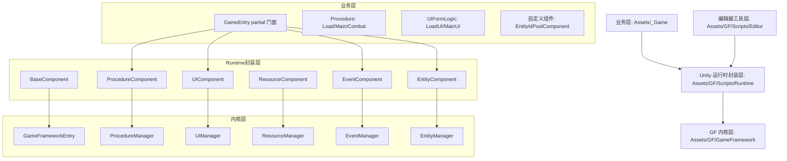
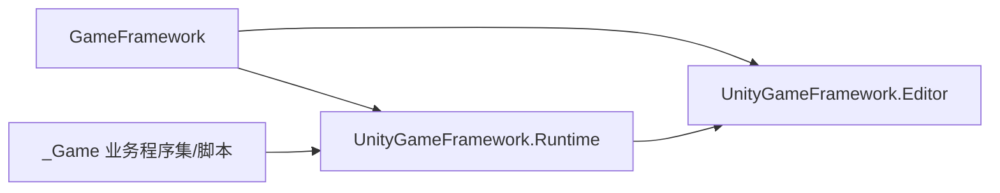
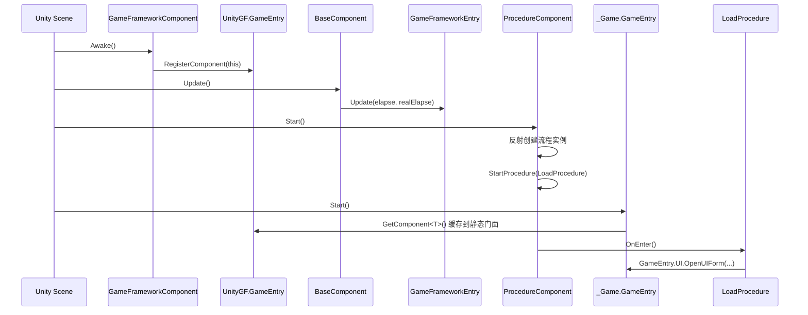
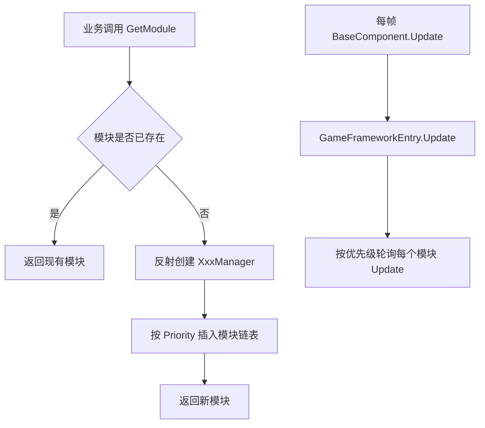
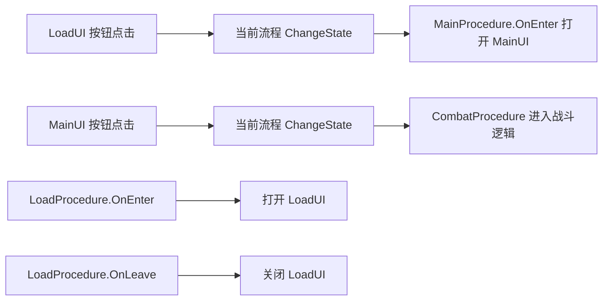

# GF 框架详细中文架构图（项目实装版）

更新时间：2026-02-27  
适用工程：`qlmt`

## 1. 分层总览图（项目当前形态）



## 2. 程序集依赖图（asmdef）



说明：

1. `GameFramework` 是纯内核，不直接写业务逻辑。  
2. `UnityGameFramework.Runtime` 是 Unity 组件化封装。  
3. `_Game` 业务层通过 Runtime 暴露接口接入。  

## 3. 启动时序图（当前场景）



## 4. 内核模块创建与更新机制图



关键点：

1. 内核模块是惰性创建（第一次 `GetModule` 时创建）。  
2. 更新顺序由模块 `Priority` 决定。  
3. 关闭时按逆序 `Shutdown`，再清理引用池和缓存内存。  

## 5. 你项目当前的运行时对象结构（简化）

```text
SampleScene
├─ Main Camera
├─ Canvas
├─ EventSystem
└─ GameFramework (根)
   ├─ [GF预制体实例节点]
   │  ├─ Base
   │  ├─ Event
   │  ├─ Procedure
   │  ├─ Resource
   │  ├─ UI
   │  ├─ Entity
   │  └─ ...其它内置组件
   └─ Customs
      └─ EntityIdPoolComponent
```

## 6. 你项目当前的业务调用路径图



## 7. 资源路径与加载模型（当前配置）

```mermaid
flowchart TD
    A[GameAssetPath.GetUI('Load/LoadUIForm')] --> B[生成路径: Prefabs/UI/Load/LoadUIForm]
    B --> C[GameEntry.UI.OpenUIForm]
    C --> D[UIComponent -> IUIManager]
    D --> E[ResourceComponent]
    E --> F[ResourceMode.Resource]
    F --> G[Resources 后端加载代理]
```

当前配置含义：

1. 你已把 `ResourceMode` 设为 `Resource`，适合当前快速迭代阶段。  
2. 业务路径组织必须和 `GameAssetPath` 返回值一致。  
3. 后续切 AB/可更新模式时，主要变更在 Resource 配置与资源构建链路，不需要推翻业务层调用入口。  

## 8. 可扩展点地图（建议按此扩）

1. 新业务系统：
   - 新建 `_Game/Scripts/Modules/XXXComponent` 继承 `GameFrameworkComponent`
   - 在 `GameEntry.CustomComponents.cs` 增加静态入口
2. 新流程：
   - 新建 `ProcedureBase` 子类
   - 加入 `ProcedureComponent` 的可用流程数组
3. 新 UI：
   - 新建 `UIFormLogic` 子类 + Prefab
   - 通过 `GameEntry.UI.OpenUIForm` 统一打开
4. 新事件：
   - 定义 `GameEventArgs` 子类
   - 用 `GameEntry.Event` 订阅/抛出

## 9. 结论

你当前 GF 架构已经稳定在“内核（GameFramework）+ Unity封装（Runtime）+ 业务门面（_Game）”三段式。只要保持业务统一走 `GameEntry` 门面，后续模块扩展和资源模式切换都可控。
